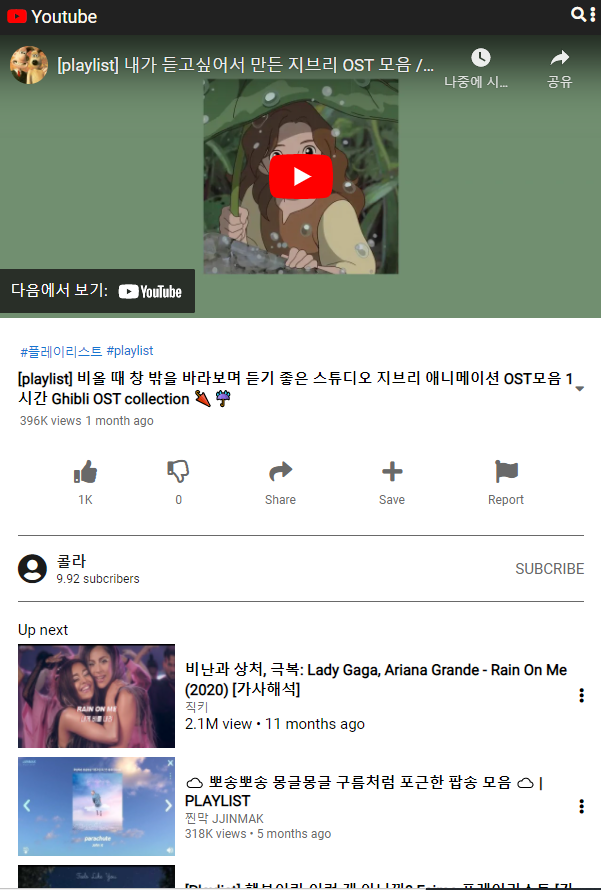
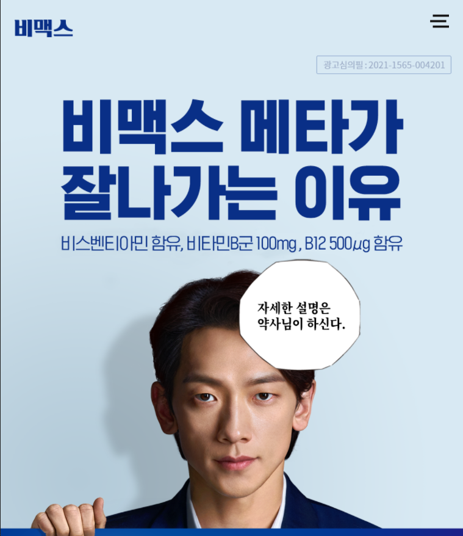
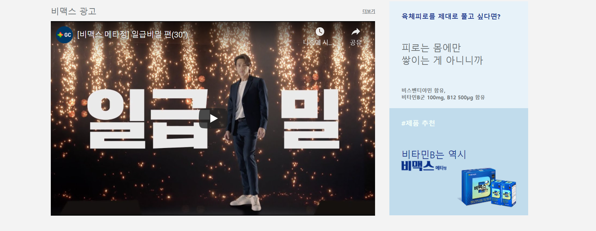

이 포스트를 통해 웹👶가 한 달동안 기존 웹사이트를 클론코딩을 하면서
만들었던 유튜브 모바일 웹사이트와 비맥스 웹사이트를 소개해드리겠습니다.  
[youtube_mobile](https://maybeluna.github.io/project01_clonecoding/youtube_m/youtube_m_index.html)  
[Bmax](https://maybeluna.github.io/project01_clonecoding/bmax/bmax_index.html)  

## 목적

**2021-spring-web-beginner** 팀에서 생활코딩을 통해 배운 html과 css를
적용하기에 가장 좋은 방법이 클론코딩이라는 말을 듣고
배운 내용을 정리 및 실습해보기 위한 용도로 만들었습니다.

## 배운 내용 적용 (mobile youtube)



### 1. css에서 flex box 사용해보기

css 기능 중 가장 헷갈리고 힘들었던 것이 레이아웃을 만드는 것이었습니다.
그렇기 때문에 css flex box를 활용하여 유튜브 버튼을 내가 원하는 위치에
배치하는 것에 힘썼습니다.  

유튜브 로고, 검색 기능, 좋아요와 싫어요 버튼 등 다양한 버튼을 만들고
이를 적재적소에 배치하여 실제 유튜브와 최대한 비슷한 레이아웃을 만들려고 노력했습니다.  

```css
// 로고
nev{
    display: flex;    
    background-color: #212121;
    color: floralwhite;
    justify-content: space-between;
    padding: 8px 8px;
    font-size: 120%;
}

.nev_bar div.logo i{
    color: red;
}

.nev_icon{
    font-size: smaller;
}

.marking{
    justify-content: center;
    padding: 20px;
}

// like, dislike 등 버튼
.mark{
    display: flex;
    justify-content: space-around;
    list-style: none;
    font-size:x-large;
    color: dimgray;
    padding-left: 0;
    margin: 0;
}

.mark li{
    display: flex;
    flex-direction: column;
    align-items: center;
}

.mark li i:hover{
    color:dodgerblue
}

.mark li div{
    font-size: small;
    padding: 10px;
}
```

### 2. css를 통해 박스 크기 조절

클론코딩을 하면서 가장 많이 신경썼던 것이 바로 박스 크기를 조절하는 것이었습니다.
처음에는 한 두개의 박스만 취급하다가 클론코딩을 통해 박스가 많아지면서 감당이 어려워졌습니다.  

박스 크기도 제각각이라서 적절한 박스 크기를 만들기 위해
`padding`과 `margin`을 최대한 활용하였습니다.

```css
// 전체 마진을 '0'으로
body{
    margin:0;
    box-sizing: border-box;
}

a{
    text-decoration: none;
    color: inherit;
}

// 제목 부분 padding, margin 조절
.info {
    margin: 20px;
}

.hashtag{
    display: flex;
    list-style: none;
    padding-left: 0;
    color: #1875d1;
    font-size: smaller;
    margin-bottom: 7px;
    margin-top: 7px;   
}

.hashtag li{
    padding: 2px;
}

.info .subject{
    display: flex;
    align-items: center;    
}

.info .subject i{
    color: dimgray;
}

.static{
    display: flex;
    list-style: none;
    padding-left: 0;
    font-size: small;
    color: dimgray;
    margin-top: 3px;
}

.static li{
    padding: 2px
}
```

## 느낀점 및 개선점 (mobile youtube)

간단한 정적인 웹페이지를 일부분이 아닌 전체적으로 하면서
전체 박스 나누는 실력이 증가하였습니다.
그러나 아직 불필요한 코드를 많이 쓰는 등
전반적으로 묶을 수 있는 부분을 세세하게 짜는 버릇을
없애야 할 것 같습니다. :)

## 배운 내용 적용 (Bmax)




### 3. css에서 position 사용하기

웹사이트에서 다양하게 위치한 버튼을 보고
저 역시 그러한 동떨어진 위치에 버튼을 놓는 방법을 사용하기 위해
`position`을 사용하였습니다.

이것을 통해 positon의 relative, absolute를 언제 가장
효과적으로 사용할 수 있는 지 배웠습니다 :)

```css
// 태블릿 버전 메뉴 버튼
    nev button{
        display:inline ; 
        background-color: var(--lightblue_color);
        border: none;
        position: relative;
        top: 100%;
        left: 100%;
    }

// 하단 버튼
button{
    background-color: #ffffff;
    border: none;
    position: relative;
    bottom: 10%;
    left: 95%;
}
```

### 4. css에서 미디어 쿼리를 통해 크기에 따른 웹사이트 만들기

media query 기능을 배우긴 하였지만 모바일, 태블릿, pc에 따라
자유자재로 변하는 웹사이트를 만드는 것은 아직 서툴어서
이번 비맥스 웹사이트를 통해 웹사이트 크기에 따라 태블릿 버전, pc 버전을 만들었습니다.

가장 중점으로 바꾼 것이 이미지 크기와 메뉴바의 유무였습니다.

```css
// 기존 pc 메뉴바
nev{
    display: flex;
    justify-content: space-between;
    align-items: center;
    background-color: var(--lightblue_color);
    padding: var(--padding);
}

nev .menu{
    list-style: none;
}

nev .menu li{
    display: inline;
    font-weight: 900;
    padding-left: 30px;
}
    
nev button{
    display: none; /* 모바일 버전 버튼 pc 상에서 감추기 */
}

// mobile 메뉴바
@media screen and (max-width: 750px) {
    nev{
        padding: 20px 50px;
    }
    
    nev .menu{
        display: none;
    }

    .logo{
        position: absolute;
        left: 20px;
        top: 20px;
    }

    nev button{ /* 모바일 버전 버튼 나타내기 */
        display:inline ; 
        background-color: var(--lightblue_color);
        border: none;
        position: relative;
        top: 100%;
        left: 100%;
    }
}

// 기존 pc 포스터
#post-laptop{
    display: flex;
    justify-content: center;
    padding: var(--padding);
    background: var(--lightblue_color);
    width: 1635px;
    }
#post-mobile{
        display: none;
    } 

// mobile 포스터
@media screen and (max-width: 750px) {
    #post-laptop{
        display: none;
    }

    #post-mobile{
        display: flex;
        background: var(--lightblue_color);
        width: 100%;
    }
}
```

## 느낀점 및 개선점 (Bmax)

자바스크립트까지 적용해 반응형 웹사이트를 만들려고 했지만
아직 JS 문법에 익숙치 않아 미디어쿼리만 적용했습니다.
하나하나 적용하니까 노가다 같은 느낌이 듭니다.
이러면서 JQuery나 프레임워크에 대한 중요성을 깨닫는 것인가 느꼈습니다.
다음에는 JS까지 공부하여 반응형 웹사이트를 만들고 싶습니다.  
