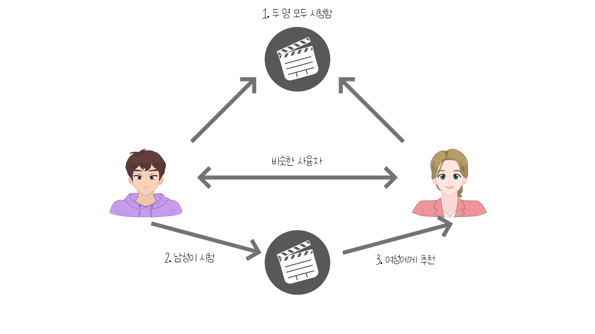
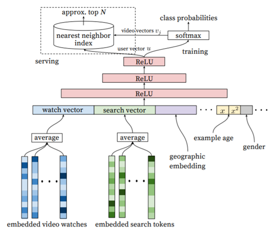

# 들어가며

><strong>알고리즘이 나를 여기로 이끌었다.</strong>

평소 유튜브를 자주 시청하는 사람이라면 종종 이런 댓글을 본 적이 있을 것입니다.
여기서 유튜브 알고리즘이란 무엇일까요?

유튜브 알고리즘이란 유튜브가 약 20억 명 이상의 사용자에게 어떤 동영상을 제안할지 결정하는 추천 시스템입니다.
이번 포스팅에서는 Youtube Recommender System 2010, 2016, 2019에 대한 리뷰를 중점으로 진행하겠습니다.

# 추천 시스템

추천 시스템(Recommender System)이란 사용자의 과거 행동 데이터나 다른 데이터를 바탕으로 사용자에게 필요한 정보 및 상품을 추천해 주는 시스템입니다.

추천 시스템 알고리즘의 종류는 크게 다음과 같이 분류됩니다.

1. 협업 필터링(Collaborative Filtering: CF)
2. 내용 기반 필터링(Content-Based filtering: CB)
3. 지식 기반 필터링(Knowledge-Based filtering: KB)
4. 딥러닝 기반 기술(Deep Learning)
5. 하이브리드(Hybrid)

여기서는 본문에서 사용될 협업 필터링에 대해서만 간단하게 설명하겠습니다.

## 협업 필터링(Collaborative Filtering: CF)

협업 필터링이란 서비스에 대한 각 소비자의 평가를 받아서 평가 패턴이 비슷한 소비자를 한 집단으로 보고 각 소비자들의 취향을 활용하는 기술입니다.

가장 기본적인 CF 알고리즘은 다음과 같습니다.

1. 모든 사용자 간의 평가의 유사도를 계산한다.
2. 현재 추천 대상이 되는 사람과 다른 사용자의 유사도를 추출한다.
3. 현재 사용자가 평가하지 않은 모든 아이템에 대해서 현재 사용자의 예산 평가 값을 구한다.
   (예산 평가 값은 다른 사용자의 해당 아이템에 대한 평가를 현재 사용자와 그 사용자와의 유사도로 가중해서 평균을 낸다.)
4. 아이템 중에서 예상 평가 값이 가장 높은 N 개의 아이템을 추천한다.

이 기술은 사람들의 취향이 뚜렷이 구분되는 제품을 추천할 때 더욱 정확하다고 알려져 있습니다.

최근에는 기술의 발전으로 인해 각 사용자 별로 맞춤형 추천을 제공하는 개인화 추천을 제공하고 있습니다.

# 유튜브 알고리즘

초기 유튜브의 추천 시스템은 다음과 같은 목표를 가지고 있었습니다.

1. To be resonably recent and fresh
2. Diverse and relevant to the user's recent actions

이 시기 유튜브 추천 시스템에서 가장 먼저 직면한 문제는 메타데이터의 부재였습니다.
콘텐츠에 대한 피드백도 명확하지가 않으며, 유튜브의 영상들은 휘발성이 강하기 때문에 지속적으로 refresh 해줄 필요가 있었습니다.
따라서 지속적으로 영상을 새로 고침 하는 'constant freshness'를 파악하는 것이 매우 중요한 과제였습니다.

## System Design

유튜브 추천 시스템은 크게 Candidate generation, Ranking 단계로 구분할 수 있습니다.

Candidate generation 단계에서는 사용자의 개인 활동(시청, 좋아요, 구독) 이력을 시드로 사용하였으며 동영상의 공동 시청 기반 그래프를 통해 동영상 세트를 확장하였습니다.

그리고 Ranking stage에서는 동영상에 대한 ranking을 매기고 몇 가지 제약을 추가하여 관련성과 다양성을 증가시켰습니다.

## Candidate Generation

### 2010년

2010년에 발표된 [The YouTube Video Recommendation System](https://scholar.google.co.kr/scholar?hl=ko&as_sdt=0%2C5&as_vis=1&q=The+YouTube+Video+Recommendation+System&btnG=)에 따르면 [association rule](#용어-정리)을 사용하여 스코어를 생성함으로써 알고리즘을 적용하였습니다.

$$ r\left(v*i, v_j\right) = \frac{c*{ij}}{f\left(v_i, v_j\right)} $$

Association rule을 사용하여 스코어를 생성할 때 co-visitation count를 하나의 섹션에서 일어난 것으로 하되, 공통의 관심 비디오를 정규화 하는 함수인 $ f(v_i, v_j) $ 로 나누어 간단하게 계산한다고 합니다.

$$ f\left(v_i, v_j\right) = c_i·c_j $$

사용자의 관심사에 가까운 콘텐츠를 추천한다는 목표를 달성하기는 하였지만 사용자에게 새로운 비디오를 추천하지는 못한다는 단점이 있었습니다.
이에 유튜브는 추천 범위를 넓히기 위해 비디오 그래프에 대해 제한적인 [전이적 폐쇄(limited transitive closure)](#용어-정리)를 수행하여 각 비디오가 체인 되는 과정을 늘림으로써 후보 세트를 확대하였습니다. 이에 따라 추천되는 영상의 커버리지 자체를 늘리는 효과를 가져왔다고 합니다.

### 2016년

2016년에도 여전히 Candidate Generation -> Ranking 이란 구조는 동일하였습니다.

하지만, [Deep Neural Networks for YouTube Recommendations(2016)](https://scholar.google.co.kr/scholar?hl=ko&as_sdt=0%2C5&as_vis=1&q=Deep+Neural+Networks+for+YouTube+Recommendations&btnG=)을 보면 2010년과 달리 위의 두 layer 모두 neural network로 대체되었다는 것을 알 수 있습니다.

위 그림과 같이 시청 기록, 검색어 토큰, 업로드 시간 등 각 유저의 정보의 average를 구하였고, 각 벡터를 단순히 이어붙였습니다(concatenate).

이어 붙인 유저의 벡터를 fully connected ReLU라 불리는 함수에 넣어서 출력값으로 각 유저의 user embedding을 얻었습니다.
그런 다음, 출력한 이 유저의 정보를 위의 [softmax 함수](#용어-정리)에 넣어서 그 유저에 대한 각 비디오의 가중치를 구하였습니다.

$$ P\left(w*t =i|U,C\right) = \frac{e^{v_iu}}{\sum*{j \in V}{e^{v_ju}}} $$

> $$v_j\in R^N은 \space 각 \space 후보 \space 비디오이며, \space u \in R^N은 \space 유저를 \space 나타낸다.$$

위 식은 softmax 함수로, 특정 시간 $ t $ 에 유저 $ U $ 가 $ C $라는 context를 가지고 있을 때 각각의 동영상 $ v_i $를 볼 확률을 정의한 것입니다.

Softmax 함수 단계에서는 모든 비디오를 입력 값으로 넣지 않고 [Negative Sampling](#용어-정리)이라는 방법으로 알맞은 비디오를 추출하여 입력 값으로 넣어줌으로써 성능 개선을 하였습니다. 사용자가 비디오를 전부 시청했다면 해당 비디오는 유저가 positive implicit feedback을 준 것으로 간주합니다.

모든 비디오를 입력 값으로 넣게 되면 대용량이기에 성능이 저하될 수 있음에 반해, Negative Sampling을 사용하면 positive 클래스와 negative 클래스로 나누어지기 때문에 이진 분류 문제가 됩니다. 이를 통해 연산량에서 효율성을 가질 수 있습니다.

여기서 추천 후보 비디오 군을 생성할 때 [협업 필터링(collaborative filtering)](<#협업-필터링(Collaborative-Filtering:-CF)>) 방식을 적용하여 개인화 서비스를 제공하였습니다. 협업 필터링을 적용할 때 사용자 간의 유사성으로 Video ID, 검색어 등을 이용하여 구현하여 개인화를 제공하였습니다.

마지막으로 유저의 정보와 softmax의 출력값을 [Nearest Neighbor 알고리즘](#용어-정리)을 이용하여 상위 N 개의 비디오를 얻습니다.

## Ranking

### 2010년

순위가 매겨지는 기준은 다음과 같습니다.

1. Video quality
2. User specificity
3. Diversification

Video quality는 영상 조회 수, 댓글, 좋아요 수, 업로드 시간 등에 따라 결정됩니다.
User specificity는 사용자의 시청 기록으로부터 사용자의 선호도를 나타내는 feature를 구합니다.
그런 다음, Video quality와 User specificity를 linear combinatin(더하기)로 합산하여 순위를 매깁니다.

유튜브의 경우 유저가 하나의 관심사만 갖는 게 아니기 때문에 최종적인 추천 영상 리스트에는 다양성이 존재해야 했습니다.

이는 같은 채널의 동영상 개수를 제한하거나 매우 유사한 비디오는 함께 보이지 않도록 함으로써 다양성을 증가시켰습니다.

### 2016년

.png>)

Ranking 모델도 동 연도의 candidate generation의 모델과 매우 유사합니다.
각 비디오의 정보(feature)를 입력 값으로 넣은 뒤 fully connected ReLU라는 함수에 넣어 순위를 매깁니다.

Feature들은 다음과 같이 분류됩니다.

1. 데이터의 형태
   - 연속형 데이터(Continuous data)
   - 범주형 데이터(Categorical data)
     - 단일 값을 가지는 경우(univalent): 비디오 ID
     - 여러 값을 가지는 경우(multivalent): 사용자가 시청했던 N 개의 비디오 ID
2. 데이터의 의미
   - Impression features: 비디오 자체에 대한 정보
   - Query features: 유저 및 context에 대한 정보

이때 다른 점은 비디오들을 학습시킬 때 [weighted logistic regression](#용어-정리)을 사용하였다는 점입니다(학습되는 데이터들은 불균형한 범주형 데이터들이기 때문에 각 클래스 별로 가중치를 설정하여 분류하는 것입니다.).
이는 추천된 영상을 얼마나 오랫동안 볼지를 예측하는 것을 목표로 합니다. 감상 시간은 안 봤으면 0, 봤으면 그 감상 시간을 가중치로 설정합니다.

### 2019년

.png)

2019년 논문은 랭킹 모델에 대해 중점적으로 설명하고 있습니다.

지난 논문에서는 가중치를 두어 추천 영상의 순위를 정하였지만 본 논문에서는 Wide & Deep 프레임워크를 채택하여 랭킹 모델을 구성하였습니다.
Wide & Deep은 넓은 선형 모델과 딥러닝 모델을 결합한 형태입니다. Wide 한 모델이 기억력은 좋지만 추천의 수가 다양하지 않다는 단점이 있어 이를 DNN과 같은 모델과 결합하여 일반화를 보완하고자 한 형태입니다.

아래는 Wide&Deep 모델을 그림으로 나타낸 것입니다.

> 출처: https://bcho.tistory.com/1187

먼저, 랭킹 모델에서의 과제는 다음과 같습니다.

1. 어떤 것을 최적화할지 잘 조정해야 한다.
2. feedback loop에 빠지지 않도록 selection bias를 효율적으로 제거해야 한다.

.png)

먼저 1번 과제의 경우 MMoE 구조를 통해 해결하고자 하였습니다.
즉, 다음에 어떤 영상을 볼지를 예측하는 것도 중요하지만 그 영상을 얼마나 시청할지, 좋아할지 등 objective를 분리시키는 것이 중요합니다.

MMoE 모델이란 Multi-gate Mixture-of-Experts의 약자로 MoE 기반 멀티 테스크 학습 모델입니다.
MoE 모델이란 입력 데이터를 서로 다른 패턴으로 학습하는 experts 네트워크를 포함하는 모델입니다. 이는 experts 네트워크에서 데이터의 서로 다른 패턴을 학습한 후에 출력값을 gating network에서 나온 가중치와 곱해져 최종적으로 학습합니다.

기존의 멀티 테스크 학습 모델이 task 간 관련성과 같은 요인들에 민감하다는 단점이 있었습니다. 이에, MMoE 모델에서는 각 task 별로 처리하는 gate를 따로 두어 task 간 관련성을 배제함으로써 학습 성능을 높였습니다.

이를 기반으로 objective를 크게 다음과 같이 분류하였습니다.

1. binary classification task(유저의 클릭)
2. regression task(시청 시간)

두 번째 과제의 경우 'shallow tower'를 통해 selection bias를 조절하고자 하였습니다.
영상의 추천 랭킹 순위와 device id 등 여러 feature를 'shallow tower'라는 함수를 통해 selection bias를 만들어 냈고, 이러한 feature는 missing value로 간주하여 높은 랭킹에 페널티를 주는 방식을 적용하였습니다.

# Reference

[1] Davidson, James, et al. "The YouTube video recommendation system." Proceedings of the fourth ACM conference on Recommender systems. 2010.

[2] Covington, Paul, Jay Adams, and Emre Sargin. "Deep neural networks for youtube recommendations." Proceedings of the 10th ACM conference on recommender systems. 2016.

[3] Zhao, Zhe, et al. "Recommending what video to watch next: a multitask ranking system." Proceedings of the 13th ACM Conference on Recommender Systems. 2019.

[4] Cheng, Heng-Tze, et al. "Wide & deep learning for recommender systems." Proceedings of the 1st workshop on deep learning for recommender systems. 2016.

[5] 임일, 「Python을 이용한 개인화 추천 시스템」, 도서출판 청람, 2020, p158

[6] towards data science, "multi-task learning with multi-gate mixture-of-experts", https://towardsdatascience.com/multi-task-learning-with-multi-gate-mixture-of-experts-b46efac3268, 2022-01-21

## 용어 정리

- [association rule](https://en.wikipedia.org/wiki/Association_rule_learning): 변수 간의 관계를 발견하기 위한 학습 방법.
- [Logistic Regression](https://wikidocs.net/22881): 종속 변수와 독립 변수 간의 관계를 함수로 설명하는 방법. 종속 변수가 범주형 데이터를 대상으로 하고, 결과가 특정 분류로 나뉜다는 점에서 선형회귀와 구분된다.
- [Weighted Logistic Regression](https://towardsdatascience.com/weighted-logistic-regression-for-imbalanced-dataset-9a5cd88e68b): 각 클래스에 가중치를 설정하여 더 나은 성능을 유도하는 선형회귀 방식.
- [Negative Sampling](https://wikidocs.net/69141): Negative Sampling: Word2Vec이 학습 과정에서 전체 단어 집합이 아니라 일부 단어 집합에만 집중할 수 있도록 하는 방법.
- [전이적 폐쇄(transitive closure)](https://www.geeksforgeeks.org/transitive-closure-of-a-graph/): 방향이 있는 그래프가 주어졌을 때 이를 Matrix로 나타내는 방법.
- [Nearest Neighbor](https://en.wikipedia.org/wiki/K-nearest_neighbors_algorithm): 주변의 샘플 정보를 통해 새로운 관측치의 종속 변숫값을 예측하는 방법.
- [softmax](https://en.wikipedia.org/wiki/Softmax_function): 다중 클래스 분류에서 사용되는 활성화 함수.
