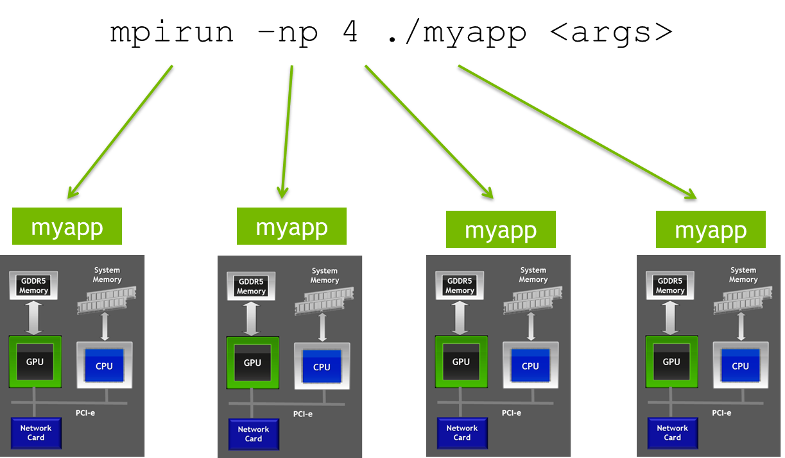
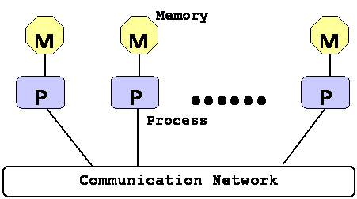

# MPI

<aside>
💡 MPI란? Message Passing Interface의 약자로, 분산 및 병렬 처리에서 사용되는 표준 라이브러리

</aside>



# MPI의 역할과 특징

멀티 GPU환경은 단일노드(한 대의 컴퓨터)와 다르게 멀티 노드에서의 분산컴퓨팅을 지원함.

하나의 작업을 다수의 프로세스들에게 나누어 실행시키는 병렬 계산에서는 필연적으로 프로세스들 사이의 통신이 필요하다.

메시지 패싱 모델은 **각자의 메모리를 지역적으로 따로 가지는 프로세스들로 구성된 분산 시스템 환**경에서, 프로세스들 사이의 통신을 오직 **메시지들의 송신(sending)과 수신(receiving)**으로만 구현하는 프로그래밍 모델을 말한다.



그래서 메시지 패싱 모델은 **프로세스들이 메모리 공간을 공유하지 않으며 한 프로세스가 다른 프로세스의 메모리에 직접 접근하는 것을 허용치 않는다.**

병렬화를 위한 작업할당, 데이터분배, 통신의 운용 등 모든 것을 프로그래머가 담당하여 어렵지만 유용함.

**MPI는 쓰레드가 아닌, 프로세스를 기준으로 작업할당을 함.**

메시지 패싱 프로그래밍 모델은 최근 들어 많이 이용되고있는데, 주된 이유 중의 한 가지는 **메시지 패싱 모델은 여러 가지 다양한 플랫폼에서 구현될 수 있기 때문**이다.

메시지 패싱 스타일로 작성된 병렬 프로그램들은 **분산, 공유메모리 다중 프로세서 환경, 워크스테이션들의 네트워크, 그리고 단일 프로세서 환경**에서도 실행할 수 있다.

지시어 기반의 OpenMP를 이용한 병렬 프로그래밍이 손쉬울지라도 메시지 패싱 모델이 병렬 컴퓨팅에서 널리 이용되고있는 이유는 특별히 쉽기 때문이 아니라 보다 일반적이기 때문이다.


# MPI의 주요 목표

- Dynamic process management
- One-sided operations
- Parellel I/O
- C++ and FORTRAN 90 bindings
- External interfaces
- Extended collective communications
- Real-time extensions
- Other areas

# MPI 용어

### Message

- 메시지는 **데이터**와 데이터의 송신지와 수신지 주소를 나타내는 **봉투(Envelope)**로 구성
- 메시지 전송은 한 서브 프로그램의 변수에서 다른 서브 프로그램의 변수로 데이터가 이동하는 것이며, 메시지 패싱 시스템은 이 **데이터의 값 자체에는 관심이 없고 오로지 그것의 이동에만 관심**이 있다.
- 일반적으로 메시지 전송 시스템이 메시지 전송을 확인하기 위해 다음과 같은 정보들이 필요하다.
    - 어떤 프로세스가 메시지를 보내는가
    - 메시지를 보내는 프로세스의 어디에 데이터가 있는가
    - 보내는 데이터는 어떤 종류인가
    - 데이터의 양은 얼마나 되는가
    - 어떤 프로세스(들)가 메시지를 받는가
    - 메시지를 받는 프로세스의 어느 위치에 데이터가 들어가는가
    - 얼마나 많은 양의 데이터를 받을 준비를 해야 하는가
- 메시지 패싱 시스템은 데이터 전달 뿐 아니라 통신에 대한 **진행상황에 대해서도 정보를 제공**해야 한다. 메시지 전송은 **메시지 동기화에 대한 정보**를 제공한다.

### Tag

- 메시지 매칭과 구분에 사용, 순서대로 메시지 도착을 처리할 수 있음

### Communicator

- 서로간에 통신이 허용되는 프로세스들의 집합
- 커뮤니케이터 이름은 모든 점대점 통신과 집합통신에 인수로 필요하며, 송신과 그에 대응하는 수신은 커뮤니케이터가 일치해야 한다. **한 프로그램 내에서 여러 개의 커뮤니케이터**가 있을 수 있고, **한 프로세스는 서로 다른 여러 커뮤니케이터에 속할 수 있다.**
- **MPI_COMM_WORLD**는 MPI에서 기본적으로 제공하는 커뮤니케이터로 MPI 헤더파일에 정의되어 있으며, **병렬 작업에 참여하는 모든 프로세스들로 구성**된다

### Rank

- **동일한 Communicator 내의 프로세스들을 식별하는 일종의 이름** , ex) 첫번째 노드는 Rank 1
- **커뮤니케이터 내에서 프로세스들은 0부터 시작되는 연속적인 정수들을 할당** 받게 되는데, 이 정수들은 커뮤니케이터 내에서 프로세스를 구분 짓는 고유의 번호로서 **프로세스 식별자 역할**을 한다.

### Point to Point Communication (점대점 통신)


- 두 개 프로세스 사이의 통신
- 하나의 송신 프로세스에 하나의 수신 프로세스가 대응

### Collective Communication (집합 통신)

- 동시에 여러개의 프로세스가 통신에 참여
- 일대다, 다대일, 다대다 통신이 가능
- 여러 번의 점대점 통신 사용을 하나의 집합 통신으로 대체할 경우 오류 가능성이 적어지며 최적화를 통한 빠른 통신이 가능해진다.

# MPI 프로그램의 기본 구조

```c
1. Include MPI Header File
2. Variable Declarations
3. Initialize the MPI Environment
4. ... Do Computation and MPI Communication Calls ...
5. Close MPI Environment
```

# MPI 헤더 파일

```c
#include <mpi.h>
```

- MPI 서브루틴과 함수의 프로토타입 선언
- 매크로, MPI 관련 인수, 데이터 타입 정의
- openmpi를 비롯한 모든 라이브러리가 같은 mpi.h 파일을 참조하는지는 모르겠음

# MPI 핸들

- MPI 고유의 내부 자료구조 참조에 이용되는 포인터 변수
- C의 핸들은 typedef로 정의된 특별한 데이터 타입을 가짐
    
    MPI_Comm, MPI_Datatype, MPI_Request...
    

# MPI 루틴의 호출과 리턴 값

- Format
    
    ```c
    err = MPI_Xxxxx (parameter, ...);
    MPI_Xxxxx (paraemter, ...);
    ```
    
- Example
    
    ```c
    error = MPI_Init (&argc, &argv);
    ```
    
- Error Code
    
    ```c
    Returned as "err", MPI_SUCCESS if successful
    ```
    
- MPI 루틴의 리턴 값
    - 호출된 MPI 루틴의 실행 성공을 알려주는 에러코드 리턴
    - 성공적으로 실행되면 정수형 상수 **'MPI_SUCCESS'** 리턴
    - MPI_SUCCESS는 헤더 파일에 선언되어있음.

# MPI 초기화

```c
int MPI_Init(&argc, &argv)
```

- MPI 환경 초기화
- MPI 루틴 중 가장 먼저, 오직 한 번 반드시 호출되어야 함.

# Communicator

- 서로 통신할 수 있는 프로세스들의 집합을 나타내는 핸들
- 모든 MPI 통신 루틴에는 커뮤니케이터가 파라미터로 포함됨.
- 커뮤니케이터를 공유하는 프로세스들 끼리는 통신이 가능
- MPI_COMM_WORLD
    - 프로그램 실행 시 정해진, 사용 가능한 모든 프로세스를 포함하는 커뮤니케이터
    - MPI_Init이 호출될 때 정의됨
- 프로세스 랭크 (Rank)
    - 같은 커뮤니케이터에 속한 프로세스의 식별 번호
    - 프로세스가 n개 있으면 0부터 n-1까지 번호 할당
    - 메시지의 송신자와 수신자를 나타내기 위해 사용
    - 프로세스 랭크 가져오기
        
        ```c
        int MPI_Comm_rank (MPI_Comm comm, int * rank)
        ```
        
        커뮤니케이터 comm에서 이 루틴을 호출한 프로세스의 랭크를 파라미터 rank를 이용하여 출력
        
- 커뮤니케이터 사이즈
    - 커뮤니케이터에 포함된 **프로세스들의 총 개수**
    - 커뮤니케이터 사이즈 가져오기
        
        ```c
        int MPI_Comm_size (MPI_Comm comm, int * size)
        ```
        
        루틴이 호출되면 커뮤니케이터 comm의 사이즈를 파라미터 size를 통해 리턴
        

# MPI 프로그램 종료

```c
int MPI_Finalize();
```

- 모든 MPI 자료구조 정리
- 모든 프로세스들에서 마지막으로 한 번 호출되어야 함.
- **프로세스를 종료 시키는 것은 아님.**

# MPI 프로그램 기본 구조 예시

```c
/* program skeleton */
#include <mpi.h>

void main(int argc, char *argv[]) {
		int rank, size;
		MPI_Init(&argc, &argv);
		MPI_Comm_rank(MPI_COMM_WORLD, &rank);
		MPI_Comm_size(MPI_COMM_WORLD, &size);
		/* ... your code here ... */
		MPI_Finalize();
}
```

# MPI 메시지

### 데이터 + 봉투

- 데이터 (버퍼, 개수, 데이터 타입)
    - 버퍼 : 수신(송신) 데이터의 변수 이름
    - 개수 : 수신(송신) 데이터의 개수
    - 데이터 타입 : 수신(송신) 데이터의 데이터 타입
- 봉투 (수신자 혹은 송신자, 태그, 커뮤니케이터)
    - 수신자(송신자) : 수신(송신) 프로세스 랭크
    - 태그 : 수신(송신) 데이터를 나타내는 고유한 정수
    - 커뮤니케이터 : 수신(송신) 프로세스들이 포함된 프로세스 그룹

### MPI 데이터

- 특정 MPI 데이터 타입을 가지는 **원소들의 배열**로 구성

### MPI 데이터 타입

- 기본 타입
    
    
    
- 유도 타입(derived type)
- 유도 타입은 기본 타입 또는 다른 유도 타입을 기반으로 만들 수 있다.
- **송신과 수신 데이터 타입은 반드시 일치해야 한다.**

# 점대점 통신과 통신 모드

### 점대점 통신


- 반드시 두 개의 프로세스만 참여하는 통신
- 통신은 커뮤니케이터 내에서만 이루어진다.
- 송신/수신 프로세스의 확인을 위해 커뮤니케이터와 랭크 사용

### **통신의 완료**

- **메시지 전송에 이용된 메모리 위치에 안전하게 접근할 수 있음**을 의미
- 송신 : 송신 변수는 통신이 완료되면 다시 사용될 수 있음
- 수신 : 수신 변수는 통신이 완료된 후 부터 사용될 수 있음

### **Blocking 통신과 Non-Blocking 통신**

- Blocking : **통신이 완료된 후 루틴으로부터 리턴** 됨.
- Non-Blocking : **통신이 시작되면 완료와 상관 없이 일단 리턴**, 완료 여부는 나중에 검사.

### 통신 모드

**통신 완료에 요구되는 조건에 따라 통신 모드 분류**


1. **동기 송신**
    
    
    
    - 송신 시작 : 대응되는 수신 루틴의 실행에 무관하게 시작
    - 송신 : 수신측이 받을 준비가 되면 전송 시작
    - 송신 완료 : 수신 루틴이 메시지를 받기 시작 + 전송 완료 (받는거랑 상관없이 일단 자기는 다 보냈을 때)
    - 가장 안전한 통신, Non-Local 송신 모드
2. **준비 송신**
    
    
    
    - **수신측이 미리 받을 준비가 되어 있다고 가정**하고 송신 시작
    - 수신이 준비되지 않은 상황에서의 송신은 에러
    - 성능면에서 유리, Non-Local 송신모드
3. **버퍼 송신**
    
    
    
    - 송신 시작 : 대응되는 수신 루틴의 실행에 무관하게 시작
    - 송신 완료 : **(시스템?)버퍼로 복사가 끝나면 수신과 무관하게 완료**
    - 사용자가 직접 버퍼 공간을 관리
        - MPI_Buffer_attach
        - MPI_Buffer_detach
    - Local 송신 모드
4. **표준 송신**
    - **직접 복사**
        
        송신 버퍼 → 수신 버퍼
        
    - **버퍼 사용**
        
        송신 버퍼 → 시스템 버퍼 → 수신 버퍼
        
    - 상황에 따라 다르게 실행됨
    - 버퍼 관리 불필요
    - **송신 완료가 반드시 메시지가 도착되었음을 의미하지 않음**
    - Non-Local 송신 모드

### Blocking 송신 : 표준

```c
int MPI_Send(void *buf, int count, MPI_Datatype datatype, int dest, int tag, MPI_Comm comm)
```

- buf (선택)
    
    송신 버퍼의 시작 주소 (Input)
    
- count (INTEGER)
    
    송신될 원소 개수 (Input)
    
- datatype (INTEGER)
    
    각 원소의 MPI 데이터 타입 (핸들) (Input)
    
- dest (INTEGER)
    
    수신 프로세스의 랭크, 통신이 불필요하면 MPI_PROC_NULL (Input)
    
- tag (INTEGER)
    
    메시지 태그 (Input)
    
- comm (INTEGER)
    
    MPI 커뮤니케이터 (핸들) (Input)
    

### Blocking 수신

```c
int MPI_Recv(void *buf, int count, MPI_Datatype datatype, int source, int tag, MPI_Comm comm, MPI_Status *status)
```

- buf (선택)
    
    수신 버퍼의 시작 주소 (Output)
    
- count (INTEGER)
    
    수신될 원소 개수 (Input)
    
- datatype (INTEGER)
    
    각 원소의 MPI 데이터 타입 (핸들) (Input)
    
- dest (INTEGER)
    
    송신 프로세스의 랭크, 통신이 불필요하면 MPI_PROC_NULL (Input)
    
- tag (INTEGER)
    
    메시지 태그 (Input)
    
- comm (INTEGER)
    
    MPI 커뮤니케이터 (핸들) (Input)
    
- status (INTEGER)
    
    수신된 메시지의 정보 저장 (Output)
    
    **수신자의 status 파라미터에 저장되는 정보**
    
    
    
    - 송신 프로세스
    - 태그
    - 데이터 크기 (MPI_Get_Count 사용)
        
        ```c
        int MPI_Get_count(MPI_Status *status, MPI_Datatype datatype, int *count)
        ```
        
        - status (INTEGER)
            
            수신된 메시지의 상태 (Input)
            
        - datatype (INTEGER)
            
            각 원소의 MPI 데이터 타입 (핸들) (Input)
            
        - count (INTEGER)
            
            원소 개수 (Output)
            
- 수신자는 와일드 카드를 사용할 수 있음
    
    모든 프로세스로 부터 메시지를 수신 : MPI_ANY_SOURCE
    
    어떤 꼬리표를 단 메시지든 모두 수신 : MPI_ANY_TAG
    

### Blocking 통신 예시

```c
#include <stdio.h>
#include <mpi.h>

void main(int argc, char *argv[]) {
		int rank, i, count;
		float data[100], value[200];
		MPI_Status status;
		MPI_Init(&argc, &argv);
		MPI_Comm_rank(MPI_COMM_WORLD, &rank);
		if(rank == 1) {
				for(i=0; i<100; ++i) {
						data[i] = i;
				}
				MPI_Send(data, 100, MPI_FLOAT, 0, 55, MPI_COMM_WORLD);
		}
		else if(rank == 0) {
				MPI_Recv(value, 200, MPI_FLOAT, MPI_ANY_SOURCE, 55, MPI_COMM_WORLD, &status);
				printf("P : %d Got data from processor %d \n", rank, status.MPI_SOURCE);
				MPI_Get_count(&status, MPI_FLOAT, &count);
				printf("P : %d Got %d elements \n", rank, count);
				printf("P : %d value[5]=%f \n", rank, value[5]);
		}
		MPI_Finalize();
}
```

### 성공적인 통신을 위해 주의할 점들

- 송신측에서 수신자 랭크를 명확히 할 것
- 수신측에서 송신자 랭크를 명확히 할 것
- 커뮤니케이터가 동일할 것
- 메시지 태그가 일치할 것
- 수신 버퍼는 충분히 클 것

### Non-Blocking 통신

- 통신을 **세 가지 상태**로 분류
    1. **Non-Blocking 통신의 초기화** : 송신 또는 수신의 포스팅
    2. **전송 데이터를 사용하지 않는 다른 작업 수행** (통신과 연산 작업을 동시 수행)
    3. **통신 완료** : 대기 또는 검사
- 교착 가능성 제거, 통신 부하 감소

### Non-Blocking 통신의 초기화

```c
int MPI_ISend(void *buf, int count, MPI_Datatype datatype, int dest, int tag, MPI_Comm comm, MPI_Request *request)
```

```c
int MPI_IRecv(void *buf, int count, MPI_Datatype datatype, int source, int tag, MPI_Comm comm, MPI_Request *request)
```

- request (INTEGER)
    
    초기화된 통신의 식별에 이용 (핸들) (Output)
    
- Non-Blocking 수신에는 **status 파라미터가 없음**

### Non-Blocking 통신의 완료

- **대기 (Waiting)**
    
    ```c
    int MPI_Wait(MPI_Request *request, MPI_Status *status)
    ```
    
    - request (INTEGER)
        
        포스팅 된 통신의 식별에 이용 (핸들) (Input & Output)
        
    - status (INTEGER)
        
        수신 메시지에 대한 정보 또는 송신 루틴에 대한 에러 코드 (Output)
        
    - **루틴이 호출되면 통신이 완료될 때까지 프로세스를 Blocking 하는 행위**
    - **Non-Blocking 통신 + 대기 = Blocking 통신**
- **검사 (Testing)**
    
    ```c
    int MPI_Test(MPI_Request *request, int *flag, MPI_Status *status)
    ```
    
    - request (INTEGER)
        
        포스팅 된 통신의 식별에 이용 (핸들) (Input & Output)
        
    - flag (INTEGER)
        
        통신이 완료되면 참, 아니면 거짓을 리턴 (Output)
        
    - status (INTEGER)
        
        수신 메시지에 대한 정보 또는 송신 루틴에 대한 에러 코드 (Output)
        
    - **루틴은 통신의 완료 여부에 따라 참 또는 거짓을 리턴**

### Non-Blocking 통신 예시

```c
#include <stdio.h>
#include <mpi.h>

void main(int argc, char *argv[]) {
		int rank, i, count;
		float data[100], value[200];
		MPI_Status status;
		MPI_Request req;
		MPI_Init(&argc, &argv);
		MPI_Comm_rank(MPI_COMM_WORLD, &rank);
		if(rank == 1) {
				for(i=0; i<100; ++i) {
						data[i] = i;
				}
				MPI_ISend(data, 100, MPI_FLOAT, 0, 55, MPI_COMM_WORLD, req);
				MPI_Wait(&req, &status);
		}
		else if(rank == 0) {
				MPI_IRecv(value, 200, MPI_FLOAT, 1, 55, MPI_COMM_WORLD, &req);
				MPI_Wait(&req, &status);
				printf("P : %d value[5]=%f \n", rank, value[5]);
		}
		MPI_Finalize();
}
```

### 점대점 통신의 사용


- 단방향 통신과 양방향 통신
- 양방향 통신의 경우 교착에 주의

### 단방향 통신 (Fortran)

- **Blocking 송신, Blocking 수신**
    
    
    
- **Non-Blocking 송신, Blocking 수신**
    
    
    
- **Blocking 송신, Non-Blocking 수신**
    
    
    
- **Non-Blocking 송신, Non-Blocking 수신**
    
    
    

### 양방향 통신

- **선 송신 후 수신 (1) : 메시지 크기에 따라 교착 가능**
    
    
    
- **선 송신 후 수신 (2) : 메시지 크기에 따라 교착 가능**
    
    
    
- **선 송신 후 수신 (3) : 메시지 크기와 무관하게 교착 없음**
    
    
    
- 선 송신 후 수신의 경우, **전송 데이터 크기에 따른 교착 여부 확인, 교착을 피하기 위한 Non-Blocking 통신 사용 권장**
- **선 수신 후 송신 (1) : 메시지 크기와 무관하게 교착**
    
    
    
- **선 수신 후 송신 (2) : 메시지 크기와 무관하게 교착 없음**
    
    
    
- 선 수신 후 송신의 경우, **전송 데이터 크기와 무관한 교착 여부 확인, 교착을 피하기 위한 Non-Blocking 통신 사용 권장**
- **권장 코드**
    
    
    

# 집합 통신

- 한 그룹의 프로세스가 참여하는 통신
- 점대점 통신 기반이며, 점대점 통신을 이용한 구현보다 편리하고 성능면에서 유리

### **집합 통신 루틴**


- 커뮤니케이터 내의 모든 프로세스에서 호출
- 동기화가 보장되지 않음 (MPI_Barrier 제외)
- Non-Blocking 루틴 없음
- 태그 없음

### MPI_Bcast

```c
int MPI_Bcast(void *buffer, int count, MPI_Datatype datatype, int root, MPI_Comm comm)
```

**root 프로세서로 부터 커뮤니케이터 내의 다른 프로세스로 동일한 데이터를 전송 (Broadcast, 일대다 통신)**

- buffer (선택)
    
    버퍼의 시작 주소 (Input & Output)
    
- count (INTEGER)
    
    버퍼 원소의 개수 (Input)
    
- datatype (INTEGER)
    
    버퍼 원소의 MPI 데이터 타입 (Input)
    
- root (INTEGER)
    
    root 프로세스의 랭크 (Input)
    
- comm (INTEGER)
    
    커뮤니케이터 (Input)
    

### MPI_Bcast 예시


```c
/* broadcast */
#include <mpi.h>
#include <stdio.h>

void main(int argc, char *argv[]) {
		int i, myrank;
		int imsg[4];
		MPI_Init(&argc, &argv);
		MPI_Comm_rank(MPI_COMM_WORLD, &myrank);

		if (myrank == 0) {
				for (i=0; i<4; i++) {
						imsg[i] = i+1;
				}
		} else {
				for (i=0; i<4; i++) {
						imsg[i] = 0;
				}
		}

		printf("%d: BEFORE:", myrank);
		for (i=0; i<4; i++) {
				printf(" %d", imsg[i]);
		}
		printf("\n");

		// Broadcast!!
		MPI_Bcast(imsg, 4, MPI_INT, 0, MPI_COMM_WORLD);

		printf("%d: AFTER:", myrank);
		for (i=0; i<4; i++) {
				printf(" %d", imsg[i]);
		}
		printf("\n");

		MPI_Finalize();
}
```

### MPI_Gather

```c
int MPI_Gather(void *sendbuf, int sendcount, MPI_Datatype sendtype, void *recvbuf, int recvcount, MPI_Datatype recvtype, int root, MPI_Comm comm)
```

**모든 프로세스(root 포함)가 송신한 데이터를 취합하여 랭크 순서대로 저장 (다대일 통신)**

- sendbuf (선택)
    
    송신 버퍼의 시작 주소 (Input)
    
- sendcount (INTEGER)
    
    송신 버퍼의 원소 개수 (Input)
    
- sendtype (INTEGER)
    
    송신 버퍼 원소의 MPI 데이터 타입 (Input)
    
- recvbuf (선택)
    
    수신 버퍼의 주소 (Output)
    
- recvcount (INTEGER)
    
    수신할 원소의 개수 (Input)
    
- recvtype (INTEGER)
    
    수신 버퍼 원소의 MPI 데이터 타입 (Input)
    
- root (INTEGER)
    
    수신 프로세스(root 프로세스)의 랭크 (Input)
    
- comm (INTEGER)
    
    커뮤니케이터 (Input)
    

### MPI_Gather 주의사항

- **송신 버퍼(sendbuf)와 수신 버퍼(recvbuf)의 메모리 위치가 겹쳐지지 않도록 주의**할 것. 즉, 같은 이름을 쓰면 안됨. (이는 송신 버퍼와 수신 버퍼를 이용하는 모든 집합 통신에 해당)
- 전송되는 데이터의 크기는 모두 동일할 것
- 크기가 서로 다른 데이터의 취합 → MPI_Gatherv

### MPI_Gather 예시


```c
/*gather*/
#include <mpi.h>
#include <stdio.h>
void main (int argc, char *argv[]) {
		int i, nprocs, myrank ;
		int isend, irecv[3];
		MPI_Init(&argc, &argv);
		MPI_Comm_size(MPI_COMM_WORLD, &nprocs);
		MPI_Comm_rank(MPI_COMM_WORLD, &myrank);

		// root(0)이면 isend 1, 1번 프로세스면 isend 2, 2번 프로세스면 isend 3
		isend = myrank + 1;

		// Gather!!
		MPI_Gather(&isend,1,MPI_INT,irecv,1,MPI_INT,0,MPI_COMM_WORLD);
		if(myrank == 0) {
				printf(“ irecv = ”);
				for(i=0; i<3; i++) {
						printf(“ %d”, irecv[i]); printf(“\n”);
				}
		}
		MPI_Finalize();
}
```

### MPI_Gatherv

```c
int MPI_Gatherv(void *sendbuf, int sendcount, MPI_Datatype sendtype, void *recvbuf, int recvcounts, int displs, MPI_Datatype recvtype, int root, MPI_Comm comm)
```

**각 프로세스로 부터 전송되는 데이터의 크기가 다를 경우 사용하며, 서로 다른 메시지 크기는 배열 recvcounts에 지정, 배열 displs에는 root 프로세스 어디에 데이터가 위치하게 되는가를 저장.**

- sendbuf (선택)
    
    송신 버퍼의 시작 주소 (Input)
    
- sendcount (INTEGER)
    
    송신 버퍼의 원소 개수 (Input)
    
- sendtype (INTEGER)
    
    송신 버퍼 원소의 MPI 데이터 타입 (Input)
    
- recvbuf (선택)
    
    수신 버퍼의 주소 (Output)
    
- recvcounts (INTEGER)
    
    수신된 원소의 개수를 저장하는 정수 배열 (Input)
    
- displs (INTEGER)
    
    정수 배열, i 번째 자리에는 프로세스 i 에서 들어오는 데이터가 저장될 수신 버퍼 상의 위치를 나타냄
    
- recvtype (INTEGER)
    
    수신 버퍼 원소의 MPI 데이터 타입 (Input)
    
- root (INTEGER)
    
    수신 프로세스(root 프로세스)의 랭크 (Input)
    
- comm (INTEGER)
    
    커뮤니케이터 (Input)
    

### MPI_Gatherv 예시


```c
/*gatherv*/
#include <mpi.h>
#include <stdio.h>
void main (int argc, char *argv[]) {
		int i, myrank ;
		int isend[3], irecv[6];
		int iscnt, ircnt[3]={1,2,3}, idisp[3]={0,1,3};
		MPI_Init(&argc, &argv);
		MPI_Comm_rank(MPI_COMM_WORLD, &myrank);
		for(i=0; i<myrank+1; i++) isend[i] = myrank + 1;
		iscnt = myrank +1;
		MPI_Gatherv(isend, iscnt, MPI_INT, irecv, ircnt, idisp, MPI_INT, 0, MPI_COMM_WORLD);
		if(myrank == 0) {
				printf(“ irecv = ”);
				for(i=0; i<6; i++) printf(“ %d”, irecv[i]);
				printf(“\n”);
		}
		MPI_Finalize();
}
```

### MPI_Allgather

```c
int MPI_Allgather(void *sendbuf, int sendcount, MPI_Datatype sendtype, void *recvbuf, int recvcount, MPI_Datatype recvtype, MPI_Comm comm)
```

**MPI_Gather + MPI_Bcast 의 역할. 프로세스 i 의 데이터 → 모든 수신 버퍼 i 번째 블록에 저장**

- sendbuf (선택)
    
    송신 버퍼의 시작 주소 (Input)
    
- sendcount (INTEGER)
    
    송신 버퍼의 원소 개수 (Input)
    
- sendtype (INTEGER)
    
    송신 버퍼 원소의 MPI 데이터 타입 (Input)
    
- recvbuf (선택)
    
    수신 버퍼의 주소 (Output)
    
- recvcount (INTEGER)
    
    각 프로세스로 부터 수신된 데이터 개수 (Input)
    
- recvtype (INTEGER)
    
    수신 버퍼 MPI 데이터 타입 (Input)
    
- comm (INTEGER)
    
    커뮤니케이터 (Input)
    

### MPI_Allgather 예시


```c
/*allgather*/
#include <mpi.h>
#include <stdio.h>
void main (int argc, char *argv[]){
		int i, myrank ;
		int isend, irecv[3];
		MPI_Init(&argc, &argv);
		MPI_Comm_rank(MPI_COMM_WORLD, &myrank);
		isend = myrank + 1;
		MPI_Allgather(&isend, 1, MPI_INT, irecv, 1, MPI_INT, MPI_COMM_WORLD);
		printf(“%d irecv = ”);
		for(i=0; i<3; i++) printf(“ %d”, irecv[i]);
		printf(“\n”);
		MPI_Finalize();
}
```

### MPI_Allgatherv

```c
int MPI_Allgatherv(void *sendbuf, int sendcount, MPI_Datatype sendtype, void *recvbuf, int recvcounts, int displs, MPI_Datatype recvtype, MPI_Comm comm)
```

**MPI_Allgather와 같은 기능을 하며 서로 다른 크기의 데이터를 취합할 때 사용**

### MPI_Allgatherv 예시


### MPI_Reduce

```c
int MPI_Reduce(void *sendbuf, void *recvbuf, int count, MPI_Datatype datatype, MPI_Op op, int root, MPI_Comm comm)
```

**각 프로세스로 부터 데이터를 모아 하나의 값으로 환산, 그 결과를 root 프로세스에 저장**

- sendbuf (선택)
    
    송신 버퍼의 시작 주소 (Input)
    
- recvbuf (선택)
    
    수신 버퍼의 주소 (Output)
    
- count (INTEGER)
    
    송신 버퍼의 원소 개수 (Input)
    
- datatype (INTEGER)
    
    송신 버퍼 원소의 MPI 데이터 타입 (Input)
    
- op (INTEGER)
    
    하나의 값으로 환산할 때 해줄 연산 (여러 개 중 최대값을 뽑는다던지...) (Input)
    
- root (INTEGER)
    
    root 프로세스의 랭크 (Input)
    
- comm (INTEGER)
    
    커뮤니케이터 (Input)
    

### MPI_Reduce의 Op와 Datatype


**MPI_MAXLOC, MPI_MINLOC에 사용된 Datatype**

### MPI_Reduce 사용자 정의 연산 (Op)

- 다음 형식으로 새로운 연산(my_operator)을 정의
    
    ```c
    void my_operator(void *invec, void *inoutvec, int *len, MPI_Datatype *datatype)
    ```
    
- 사용자 정의 연산의 등록 (my_operator를 op로 등록)
    
    파라미터 commute 가 참이면 환산이 좀 더 빠르게 수행됨
    
    ```c
    int MPI_Op_create(MPI_User_function *my_operator, int commute, MPI_Op *op)
    ```
    

### MPI_Reduce 예시


### MPI_Reduce 예시 (Reduce 결과가 배열)


### MPI_Allreduce

```c
int MPI_Allreduce(void *sendbuf, void *recvbuf, int count, MPI_Datatype datatype, MPI_Op op, MPI_Comm comm);
```

**각 프로세스로 부터 데이터를 모아 하나의 값으로 환산, 그 결과를 모든 프로세스에 저장**

### MPI_Allreduce 예시


### MPI_Scatter

```c
int MPI_Scatter(void *sendbuf, int sendcount, MPI_Datatype sendtype, void *recvbuf, int recvcount, MPI_Datatype recvtype, int root, MPI_Comm comm)
```

**root 프로세스는 데이터를 같은 크기로 나누어 각 프로세스에 랭크 순서대로 하나씩 전송**

- sendbuf (선택)
    
    송신 버퍼의 시작 주소 (Input)
    
- sendcount (INTEGER)
    
    각 프로세스로 보내지는 원소 개수 (Input)
    
- sendtype (INTEGER)
    
    송신 버퍼 원소의 MPI 데이터 타입 (Input)
    
- recvbuf (선택)
    
    수신 버퍼의 주소 (Output)
    
- recvcount (INTEGER)
    
    수신 버퍼의 원소의 개수 (Input)
    
- recvtype (INTEGER)
    
    수신 버퍼의 MPI 데이터 타입 (Input)
    
- root (INTEGER)
    
    송신 프로세스(root 프로세스)의 랭크 (Input)
    
- comm (INTEGER)
    
    커뮤니케이터 (Input)
    

### MPI_Scatter 예시


### MPI_Scatterv

```c
int MPI_Scatter(void *sendbuf, int sendcounts, int displs, MPI_Datatype sendtype, void *recvbuf, int recvcount, MPI_Datatype recvtype, int root, MPI_Comm comm)
```

**root 프로세스는 데이터를 서로 다른 크기로 나누어 각 프로세스에 랭크 순서대로 하나씩 전송**

- sendbuf (선택)
    
    송신 버퍼의 시작 주소 (Input)
    
- sendcounts (INTEGER)
    
    정수 배열, i 번째 자리에 프로세스 i 로 전송될 데이터 개수 저장 (Input)
    
- displs (INTEGER)
    
    정수 배열, i 번째 자리에 프로세스 i 로 전송될 데이터의 송신 버퍼 상의 상대적 위치가 저장됨 (Input)
    
- sendcount (INTEGER)
    
    각 프로세스로 보내지는 원소 개수 (Input)
    
- sendtype (INTEGER)
    
    송신 버퍼 원소의 MPI 데이터 타입 (Input)
    
- recvbuf (선택)
    
    수신 버퍼의 주소 (Output)
    
- recvcount (INTEGER)
    
    수신 버퍼의 원소의 개수 (Input)
    
- recvtype (INTEGER)
    
    수신 버퍼의 MPI 데이터 타입 (Input)
    
- root (INTEGER)
    
    송신 프로세스(root 프로세스)의 랭크 (Input)
    
- comm (INTEGER)
    
    커뮤니케이터 (Input)
    

### MPI_Scatterv 예시


### MPI_Barrier

```c
int MPI_Barrier(MPI_Comm comm)
```

**커뮤니케이터 내의 모든 프로세스가 MPI_Barrier를 호출할 때까지 더 이상의 프로세스 진행을 막음**

### MPI_Alltoall

```c
int MPI_Alltoall(void *sendbuf, int sendcount, MPI_Datatype sendtype, void *recvbuf, int recvcount, MPI_Datatype recvtype, MPI_Comm comm)
```

**각 프로세스로 부터 모든 프로세스에 동일한 크기의 개별적인 메시지를 전달**

**프로세스 i 로 부터 송신되는 j 번째 데이터 블록은 프로세스 j 가 받아 수신 버퍼의 i 번째 블록에 저장**

### MPI_Alltoall 예시


### MPI_Alltoallv

```c
int MPI_Alltoallv(void *sendbuf, int sendcounts, int sdispls, MPI_Datatype sendtype, void *recvbuf, int recvcounts, int rdispls, MPI_Datatype recvtype, MPI_Comm comm)
```

**각 프로세스로 부터 모든 프로세스에 서로 다른 크기의 개별적인 메시지를 전달**

**프로세스 i 로 부터 송신되는 sendcounts[j]개의 데이터는 프로세스 j 가 받아 수신 버퍼의 rdispls[i] 번째 위치부터 저장**

### MPI_Alltoallv 예시


### MPI_Reduce_scatter

```c
int MPI_Reduce_scatter(void *sendbuf, void *recvbuf, int recvcounts, MPI_Datatype datatype, MPI_Op op, MPI_Comm comm)
```

**각 프로세스의 송신 버퍼에 저장된 데이터를 환산 연산(Reduction Operation)을 수행하고 그 결과를 차례대로 recvcount[i] 개씩 모아서 프로세스 i 로 송신 (MPI_Reduce + MPI_Scatterv)**

### MPI_Reduce_scatter 예시


### MPI_Scan

```c
int MPI_Scan(void *sendbuf, void *recvbuf, int count, MPI_Datatype datatype, MPI_Op op, MPI_Comm comm)
```

**프로세스 i 의 수신 버퍼에 프로세스 0에서 프로세스 i 까지의 수신 버퍼 데이터들에 대한 환산(Reduction) 값을 저장한다.**

### MPI_Scan 예제


# 유도 데이터 타입

**데이터 타입이 다르거나 불연속적인 데이터를 전송하는 몇 가지 경우를 생각해보자.**

- 동일한 데이터 타입을 가지는 불연속 데이터
- 다른 데이터 타입을 가지는 연속 데이터
- 다른 데이터 타입을 가지는 불연속 데이터

**각각을 따로따로 전송하거나, 새로운 버퍼로 묶어서 전송 후 묶음을 풀어 원위치로 저장**(MPI_Pack, MPI_Unpack, MPI_PACKED 등 이용)함으로써 구현은 할 수 있지만 이 경우 **느린 속도, 오류의 위험** 등의 문제점이 있다.

**새로운 데이터 타입을 정의(유도 데이터 타입)하여 전송 함으로써 이러한 문제를 해결 가능.**

### 예시


### 유도 데이터 타입의 사용

- **Construct**
    
    MPI 루틴을 이용하여 새로운 데이터 타입 작성
    
    - MPI_Type_contiguous
    - MPI_Type_(h)vector
    - MPI_Type_struct
- **Commit**
    
    작성된 데이터 타입 등록
    
    - MPI_Type_Commit
- **Use**
    
    송신, 수신 등에 새로운 데이터 타입 사용
    

### MPI_Type_commit

```c
int MPI_Type_commit(MPI_Datatype *datatype)
```

**새롭게 정의된 데이터 타입을 통신 상에서 사용 가능하게 함.**

**등록된 데이터 타입은 MPI_Type_free(datatype, Ierr)을 이용하여 해제하기 전까지 계속 사용 가능.**

- datatype (INTEGER)
    
    등록 데이터 타입(핸들) (Input & Output)
    

### MPI_Type_contiguous

```c
int MPI_Type_contiguous(int count, MPI_Datatype oldtype, MPI_Datatype *newtype)
```

**같은 데이터 타입(oldtype)을 가지는 연속적인 데이터를 count 개 묶어 새로운 데이터 타입(newtype) 정의**

- count (INTEGER)
    
    하나로 묶을 데이터 개수 (Input)
    
- oldtype (INTEGER)
    
    이전 데이터 타입(핸들) (Input)
    
- newtype (INTEGER)
    
    새로운 데이터 타입(핸들) (Output)
    

### MPI_Type_contiguous 예시


### MPI_Type_vector


```c
int MPI_Type_vector(int count, int blocklength, int stride, MPI_Datatype oldtype, MPI_Datatype *newtype)
```

**똑같은 간격만큼 떨어져 있는 count 개 블록들로 구성되는 새로운 데이터 타입 정의**

**각 블록에는 blocklength 개의 이전 타입 데이터 있음.**

- count (INTEGER)
    
    블록의 개수 (Input)
    
- blocklength (INTEGER)
    
    각 블록의 oldtype 데이터의 개수 (Input)
    
- stride (INTEGER)
    
    인접한 두 블록의 시작점 사이의 폭 (Input)
    
- oldtype (INTEGER)
    
    이전 데이터 타입(핸들) (Input)
    
- newtype (INTEGER)
    
    새로운 데이터 타입(핸들) (Output)
    

### MPI_Type_vector 예시


### MPI_Type_hvector


```c
int MPI_Type_hvector(int count, int blocklength, int stride, MPI_Datatype oldtype, MPI_Datatype *newtype)
```

**MPI_Type_vector에서 stride를 바이트 단위로 표시한 루틴**

### MPI_Type_struct


```c
int MPI_Type_hvector(int count, int *array_of_blocklengths, MPI_Aint *array_of_displacements, MPI_Datatype *array_of_type, MPI_Datatype *newtype)
```

**가장 일반적인 유도 데이터 타입**

**서로 다른 데이터 타입들로 구성된 변수 정의 가능**

- **C 구조체**
- **Fortran Common Block**

**count 개 블록으로 구성된 새로운 데이터 타입 정의, i 번째 블록은 데이터 타입이 array_of_types[i]인 array_of_blocklengths[i]개의 데이터로 구성되며 그 위치는 array_of_displacements[i]가 됨.** 

- count (INTEGER)
    
    블록의 개수, 동시에 배열 array_of_blocklengths, array_of_displacements, array_of_types의 원소 개수를 나타냄 (Input)
    
- array_of_blocklengths (INTEGER)
    
    각 블록 당 데이터의 개수, array_of_blocklengths[i]는 데이터 타입이 array_of_types[i]인 i 번째 블록의 데이터 개수 (Input)
    
- array_of_displacements (INTEGER)
    
    바이트로 나타낸 각 블록의 위치 (Input)
    
- array_of_types (INTEGER)
    
    각 블록을 구성하는 데이터 타입, i 번째 블록은 데이터 타입이 array_of_types[i]인 데이터로 구성 (Input)
    
- newtype (INTEGER)
    
    새로운 데이터 타입(핸들) (Output)
    

### MPI_Type_struct 예시


### MPI_Type_extent (Deprecated)

```c
int MPI_Type_extent(MPI_Datatype *datatype, MPI_Aint *extent)
```

**데이터 타입의 범위(extent) = 메모리에서 차지하는 바이트 수**

- datatype (INTEGER)
    
    데이터 타입(핸들) (Input & Output)
    
- extent (INTEGER)
    
    데이터 타입의 범위 (Output)
    

### MPI_Type_extent 예시


# 부분 배열의 전송

### MPI_Type_create_subarray

```c
int MPI_Type_create_subarray(int ndims, int *array_of_sizes, int *array_of_subsizes, int *array_of_starts, int order, MPI_Datatype oldtype, MPI_Datatype *newtype)
```

**부분 배열로 구성되는 유도 데이터 타입 생성 루틴**

- ndims (INTEGER)
    
    배열의 차원(양의 정수) (Input)
    
- array_of_sizes (INTEGER)
    
    전체 배열의 각 차원의 크기, i 번째 원소는 i 번째 차원의 크기(양의 정수) (Input)
    
- array_of_subsizes (INTEGER)
    
    부분 배열의 각 차원의 크기, i 번째 원소는 i 번째 차원의 크기(양의 정수) (Input)
    
- array_of_starts (INTEGER)
    
    부분 배열의 시작 좌표, i 번째 원소는 i 번째 차원의 시작 좌표(0부터 시작) (Input)
    
- order (INTEGER)
    
    배열 저장 방식(행 우선 또는 열 우선) 결정 (Input)
    
    - MPI_ORDER_FORTRAN : 행 우선
    - MPI_ORDER_C : 열 우선
- oldtype (INTEGER)
    
    전체 배열 원소의 데이터 타입 (Input)
    
- newtype (INTEGER)
    
    부분 배열로 구성된 새로운 데이터 타입 (Output)
    

### 부분 배열의 전송 예제


# 프로세스 그룹 생성

### MPI_Comm_split

```c
int MPI_Comm_split(MPI_Comm comm, int color, int key, MPI_Comm *newcomm)
```

**comm 내의 프로세스들을 여러 그룹으로 묶은 새로운 커뮤니케이터 newcomm 생성 (부분집합 개념)**

- comm (INTEGER)
    
    커뮤니케이터(핸들) (Input)
    
- color (INTEGER)
    
    같은 color 를 가지는 프로세스들을 같은 그룹에 포함 (Input)
    
    color ≥ 0
    
    color = MPI_UNDEFINED → newcomm → MPI_COMM_NULL
    
- key (INTEGER)
    
    key 순서에 따라 그룹 내의 프로세스에 새로운 랭크를 할당 (Output)
    
- newcomm (INTEGER)
    
    새로운 커뮤니케이터(핸들) (Output)
    

### MPI_Comm_split 예시


# 가상 토폴로지


- 통신 패턴에 적합하도록 프로세스에 적절한 이름을 부여한 새로운 커뮤니케이터를 구성하는 것.
- 코드 작성을 쉽게 하고 최적화된 통신을 가능하게 함.
- **직교 가장 토폴로지**
    - 가상적인 그리드 상에서 각 프로세스가 인접한 이웃과 연결
    - 각 프로세스는 직교좌표 값으로 식별됨
    - 주기적 경계 조건 (Periodic Boundary Condition)

### 가상 토폴로지의 사용

- 토폴로지를 만들어 새로운 커뮤니케이터 생성
    - MPI_CART_CREATE
- MPI 대응 함수를 통해 토폴로지 상의 명명 방식에 근거한 프로세스 랭크 계산
    - MPI_CART_RANK
    - MPI_CART_COORDS
    - MPI_CART_SHIFT

### MPI_Cart_create

```c
int MPI_Cart_create(MPI_Comm oldcomm, int ndims, int *dimsize, int *periods, int reorder, MPI_Comm *newcomm)
```

**가상 토폴로지의 구성을 가지는 커뮤니케이터 newcomm 리턴**

**reorder 파라미터가 거짓이면 기존 커뮤니케이터의 랭크를 그대로 가지고 랭크와 토폴로지 그리드 좌표 사이의 대응만 설정함.**

- oldcomm (INTEGER)
    
    기존 커뮤니케이터 (Input)
    
- ndims (INTEGER)
    
    직교좌표의 차원 (Input)
    
- dimsize (INTEGER)
    
    각 좌표축의 길이. 크기 ndims의 배열 (Output)
    
- periods (LOGICAL) (BOOL)
    
    각 좌표축의 주기성 결정. 크기 ndims의 배열 (Input)
    
- reorder (LOGICAL)
    
    MPI가 프로세스 랭크를 재정렬할 것인가를 결정 (Input)
    
- newcomm (INTEGER)
    
    새로운 커뮤니케이터 (Output)
    

### MPI_Cart_create 예시


### MPI_Cart_rank

```c
int MPI_Cart_rank(MPI_Comm comm, int *coords, int *rank)
```

**프로세스 직교좌표를 대응되는 프로세스 랭크로 나타냄**

**좌표를 알고 있는 경우 그 좌표에 해당하는 프로세스와의 통신을 위해 사용**

- comm (INTEGER)
    
    가상 토폴로지로 생성된 커뮤니케이터 (Input)
    
- coords (INTEGER)
    
    직교좌표를 나타내는 크기 ndims의 배열 (Input)
    
- rank (INTEGER)
    
    coords에 의해 표현되는 프로세스의 랭크 (Output)
    

### MPI_Cart_rank 예시


### MPI_Cart_coords

```c
int MPI_Cart_coords(MPI_Comm comm, int rank, int ndims, int *coords)
```

**프로세스 랭크를 대응되는 직교좌표로 나타냄 (MPI_Cart_rank의 역함수)**

- comm (INTEGER)
    
    가상 토폴로지로 생성된 커뮤니케이터 (Input)
    
- rank (INTEGER)
    
    루틴을 호출한 프로세스의 랭크 (Input)
    
- ndims (INTEGER)
    
    직교좌표의 차원 (Input)
    
- coords (INTEGER)
    
    랭크에 대응되는 직교좌표 (Output)
    

### MPI_Cart_coords 예시


### MPI_Cart_shift

```c
int MPI_Cart_shift(MPI_Comm comm, int direction, int displ, int *source, int *dest)
```

**실제 Shift를 실행하는 것은 아님.**

**특정 방향을 따라 루틴을 호출한 프로세스의 이웃 프로세스의 랭크를 구하는데에 사용**

- comm (INTEGER)
    
    가상 토폴로지로 생성된 커뮤니케이터 (Input)
    
- direction (INTEGER)
    
    시프트할 방향 (Input)
    
- displ (INTEGER)
    
    프로세스 좌표상의 시프트할 거리(+/-) (Input)
    
- source (INTEGER)
    
    direction 방향으로 displ 떨어진 거리에 있는 프로세스 (Output)
    
    displ > 0 일때 직교좌표가 작아지는 방향의 프로세스 랭크
    
- dest (INTEGER)
    
    direction 방향으로 displ 떨어진 거리에 있는 프로세스 (Output)
    
    displ > 0 일때 직교좌표가 커지는 방향의 프로세스 랭크
    

### MPI_Cart_shift 예시


### MPI_Cart_sub

```c
int MPI_Cart_sub(MPI_Comm oldcomm, int *belongs, MPI_Comm *newcomm)
```

**직교 토폴로지를 축 방향으로 분해하여 여러 개의 서브 토폴로지로 구성되는 새로운 커뮤니케이터 생성**

**토폴로지 상의 특정 행 또는 열 들에 대해서만 통신이 필요한 경우 사용**

**MPI_Comm_split 과 유사**

- oldcomm (INTEGER)
    
    가상 토폴로지로 생성된 커뮤니케이터 (Input)
    
- belongs (LOGICAL)
    
    토폴로지 상에서 해당 좌표축 방향으로의 분해 여부를 나타내는 ndims 크기의 배열 (Input)
    
- newcomm (INTEGER)
    
    토폴로지를 분해한 새로운 커뮤니케이터 (Output)
    

### MPI_Cart_sub 예시


# 병렬 프로그램의 입출력

### 공유 파일 시스템으로부터 동시에 읽어오기


### 입력파일의 복사본을 각각 따로 가지는 경우


### 한 프로세스가 입력 파일을 읽어 다른 프로세스에 전달(모두 같은 데이터)


### 한 프로세스가 입력 파일을 읽어 다른 프로세스에 전달(각각 다른 데이터)


# 병렬 프로그램의 출력

### 표준 출력 (IBM 환경변수를 통해 지정?)

- 모든 프로세스들이 출력
- 원하는 프로세스만 출력

### 한 프로세스가 데이터를 모아 로컬 파일시스템에 저장


### 각 프로세스가 공유 파일 시스템에 순차적으로 저장


# for 루프의 병렬화

**루프 내에서 반복되는 계산의 할당 문제는 루프 인덱스와 관련된 인덱스를 가지는 배열의 할당 문제가 됨.**

- 배열을 어떻게 나눌 것인가?
- 나눠진 배열과 관련 계산을 어떻게 효율적으로 할당할 것인가?

## 배열의 분할

### 블록 분할 (Block Distribution)


- $**n = p \times q + r**$
    - n : 반복 계산 회수
    - p : 프로세스 개수
    - q : n을 p로 나눈 몫
    - r : n을 p로 나눈 나머지
- **r 개 프로세스에 q + 1 번, 나머지 프로세스에 q 번의 계산 할당**
    
    $**n = r(q+1)+(p-r)q**$
    
- **블록 분할 코드 예시**
    
    
    
    - n1 부터 n2 까지 반복되는 루프 계산을 nproc 개 프로세스에 블록 분할을 이용해 할당하는 서브루틴
    - 프로세스 irank 가 ista 부터 iend 까지 계산을 할당받음.
- 블록 분할 예제
    
    
    
    
    
    
    

### 순환 분할 (Cyclic Distribution)


Fortran 기준이라 DO인데 DO는 C의 for과 같음

- 블록 분할보다 효과적인 로드밸런싱
- 블록 분할보다 캐시미스 발생이 많아짐

### 블록-순환 분할 (Block-Cyclic Distribution)


## 배열 수축 (Shrinking Arrays)

**병렬화 작업에 참여하는 프로세스는 전체 배열을 가져올 필요 없이 자신이 계산을 담당한 부분의 데이터만 메모리에 가져와 계산을 수행**하면 됨. (다른 프로세스의 데이터가 필요하면 통신을 통해 송/수신)

**n개의 프로세서를 연결한 분산 메모리 시스템은 1개의 프로세서를 가진 시스템보다 n배의 메모리를 사용**할 수 있음.

사용자는 분산 메모리 시스템에서의 병렬화 작업을 통하여 처리하는 데이터 크기를 증가시킬 수 있게 됨. (배열 수축 기술)

**세계 지도로 표현한 실행에 따른 차이...?**

### 순차 실행


### 병렬 실행


## 메모리 동적 할당 예제


# 내포된 루프의 병렬화

**캐시미스와 통신의 최소화에 유념**


2차원 배열이 메모리에 저장되는 방식(Fortran, C)

## 캐시미스 줄이기 (Fortran 기준)

### 메모리 저장 방식에 의한 캐시미스 차이


Fortran은 루프 B에서 더 많은 캐시미스가 발생하므로, 루프 A가 더 빠르게 실행됨. → 루프 A의 병렬화 (루프 A 형태를 여러개 만들어 각 작업으로 할당)

### 바깥쪽 루프와 안쪽 루프의 병렬화에 따른 캐시미스 차이


Fortran은 루프 A2에서 더 많은 캐시미스가 발생하므로, 루프 A1이 더 빠르게 실행됨.

## 통신량 줄이기

### 한 방향으로 필요한 데이터를 통신해야 하는 경우


**바깥쪽 루프(열 방향) 병렬화에 의해 요구되는 통신**


**이 경우 안쪽 루프 (행 방향)의 병렬화는 통신 필요 없음**

### 양 방향으로 필요한 데이터를 통신해야 하는 경우


**m, n의 크기에 의존**


### 안쪽과 바깥쪽 모두에 대해 병렬화를 하는 경우


- 프로세스의 개수는 합성수여야 함
- 블록의 형태가 정사각형에 가까울수록 통신량이 감소

# 다른 프로세스의 데이터 참조

## 외부 데이터 참조의 간단한 예

### 병렬화 과정에서 다른 프로세스가 가진 데이터를 참조해야 하는 경우


## 1차원 유한 차분법 (FDM)

> **1차원 유한 차분법(Finite Difference Method)**은 연속된 공간에서 정의된 미분방정식을 차분방정식으로 근사시켜 풀어내는 방법으로, 손으로 풀기 어려운 복잡한 문제의 근사해를 구하는 데 많이 사용되는 수치해석 기법 중 하나이다.
> 

**대충 이러한 워크로드가 있고, 우리는 병렬화를 통해 이를 구현할 것이다.**

### 1차원 유한 차분법의 핵심부 (순차 프로그램의 경우)


### 1차원 유한 차분법의 데이터 의존성


깊게 이해하려 들지 말고 대충 a[2]는 2의 앞 뒤 인덱스인 b[1], b[3]의 값을 참조하여 결정된다... 정도만

### 1차원 유한 차분법을 병렬화 시켰을 때의 데이터 전송


### 1차원 유한 차분법 병렬화 코드


## 대량 데이터 전송

### 각 프로세스의 모든 데이터를 한 프로세스로 취합

1. 연속 데이터 : 송/수신 버퍼가 중복되지 않는 경우
2. 연속 데이터 : 송/수신 버퍼가 중복되는 경우
3. 불연속 데이터 : 송/수신 버퍼가 중복되는 경우
4. 불연속 데이터 : 송/수신 버퍼가 중복되지 않는 경우

### 모든 프로세스가 가진 전체 배열을 동시에 갱신

1. 송/수신 버퍼가 중복되지 않는 경우
2. 송/수신 버퍼가 중복되는 경우

### 블록 분할된 데이터의 전환(행 방향 ↔ 열 방향)과 재할당

## 연속 데이터 취합

### 송/수신 버퍼가 중복되지 않는 경우


그림은 Fortran 기준


### 송/수신 버퍼가 중복되는 경우


그림은 Fortran 기준


## 불연속 데이터 취합

### 송/수신 버퍼가 중복되는 경우


그림은 Fortran 기준


## 데이터 동기화

### 송/수신 버퍼가 중복되지 않는 경우


그림은 Fortran 기준


### 송/수신 버퍼가 중복되는 경우


그림은 Fortran 기준


# 블록 분할의 전환

## 열 방향 블록 분할 → 행 방향 블록 분할


### 유도 데이터 타입 정의 : MPI_Type_create_subarray


### 병렬화 코드


# 중첩

### 환산 연산(Reduce)을 이용한 데이터 취합(Gather)

- 각 프로세스가 모든 데이터를 가지고 있으며(배열 수축 없음)
- 불연속적인 데이터에 대한 계산 수행 후
- 그 결과를 한 프로세스로 모으고자 할 때

### → 계산을 수행한 불연속 데이터를 제외한 모든 데이터를 0으로 두고 환산 연산 수행


### Fortran 코드


# 파이프라인 방법

### 실행에 의존성을 가지는 루프 1


### 실행에 의존성을 가지는 루프 2


### 의존성을 가지는 루프의 병렬화 (Fortran 기준)


### 의존성을 가지는 루프의 병렬화 코드


### 데이터의 흐름 : 교착에 빠지지 않음


### 블록(iblock, jblock) 크기 결정

**동시 수행되는 부분이 많을수록 통신 부담이 커지게 됨**


# 비틀림 분해

**항상 모든 프로세스가 참여하는 병렬화 기능**

- 파이프라인 방법보다 성능면에서 유리
- 효과적인 로드 밸런싱
- 데이터 분배가 복잡하여 코드 작성이 어려움

### 비틀림 분해의 예시 : Fortran


1. 행과 열을 각각 프로세스 개수(nprocs)의 블록으로 분해
2. 각 블록의 위치를 좌표(i, j)로 표현
3. (i, j) 블록의 계산을 (j-i+nprocs)를 nprocs로 나눈 나머지에 할당되는 프로세스에 할당

### 비틀림 분해를 이용한 병렬화 코드


### 데이터 흐름 : 교착에 주의하여야 함


# 프리픽스 합

### 내포되지 않은 루프(1차원 배열)가 의존성을 가지는 경우


### 프리픽스 합을 이용한 병렬화 코드


# MPI 병렬 프로그램 예제

## 2차원 유한 차분법의 병렬화

### 2차원 유한 차분법의 핵심부 (순차 프로그램의 경우)


### 2차원 유한 차분법의 핵심

- 양 방향 의존성을 모두 가지고 있음
- 통신량을 최소화하는 데이터 분배 방식 결정
    - 열 방향 블록 분할
    - 행 방향 블록 분할
    - 양 방향 블록 분할

### 열 방향 블록 분할

**경계 데이터 : Fortran은 연속, C는 불연속**


**열 방향 블록 분할 코드 (C 기준)**


### 행 방향 블록 분할

**경계 데이터 : Fortran은 불연속, C는 연속**


**행 방향 블록 분할 코드 (C 기준)**


### 양 방향 블록 분할 (프로세스 그리드 이용)


**양 방향 블록 분할 코드 (C 기준)**


## 몬테카를로 방법의 병렬화

### 2차원 임의 행로


### 2차원 임의 행로 코드 (C 기준)


## 분자 동역학

### 이론

- 1차원 상에서 상호작용 하는 두 개 입자
    
    
    
- 입자 i가 받게 되는 힘의 종합
    
    
    

### 7개의 입자


### Fortran 코드 (순차 프로그램의 경우)


- 삼각형 모양의 루프 실행
- 순환 분할 (i또는 j에 대해)

### 변수 i에 대한 순환 분할 (Fortran)


### 변수 j에 대한 순환 분할 (Fortran)


## MPMD 모델


### MPMD 병렬 실행 : IBM AIX(ksh)

```bash
$mpxlf90 fluid.f –o fluid
$mpxlf90 struct.f –o struct
$export MP_PGMMODEL=mpmd
$export MP_CMDFILE=cmdfile
$poe –procs 2
```

### cmdfile : 실행 명령 구성 파일

fluid, struct

### 마스터-워커 MPMD 프로그램


# MPI-2

## MPI-2에 추가된 영역

1. 병렬 I/O (MPI I/O)
2. 원격 메모리 접근 (일방 통신)
3. 동적 프로세스 운영

## 병렬 I/O

- MPI-2에서 지원
- 운영체제가 지원하는 일반적인 순차 I/O 기능 기반에 추가적인 성능과 안정성 지원

### 병렬 프로그램과 순차 I/O

**예 : 각 프로세스가 가진 100개의 정수 출력**

1. 각 프로세스가 배열 buf[] 초기화
2. 프로세스 0을 제외한 모든 프로세스는 배열 buf[]를 프로세스 0으로 송신
3. 프로세스 0은 가지고 있는 배열을 파일에 먼저 기록하고, 다른 프로세스로 부터 차례로 데이터를 받아 파일에 기록

**첫 번째 경우**


- 하나의 프로세스가 모든 I/O 담당
- 편리할 수 있지만 성능과 범위성에 한계가 있음


**두 번째 경우**


- 모든 프로세스가 독립적으로 각자의 I/O 기능 담당
- 여러 파일 생성으로 인해 결과 처리가 불편


### 병렬 I/O의 사용

**기본적인 병렬 I/O 루틴의 사용**

- MPI_File_open
- MPI_File_write
- MPI_File_close

**예시 : 개별적인 파일을 생성하는 C 코드**


### MPI_File_open

```c
int MPI_File_open(MPI_Comm comm, char *filename, int amode, MPI_Info info, MPI_File *fh)
```

**(집합 통신) 동일 커뮤니케이터의 프로세스는 같은 파일 오픈**

**MPI_COMM_SELF : 프로세스 하나로 구성되는 커뮤니케이터**

- comm (INTEGER)
    
    커뮤니케이터 (핸들) (Input)
    
- filename (CHAR)
    
    오픈하는 파일 이름 (Input)
    
- amode (INTEGER)
    
    파일 접근 모드 (Input)
    
    C에서는 OR 연산( | )으로 연결 가능
    
    
    
- info (INTEGER)
    
    info 객체 (핸들) (Input)
    
    시스템 환경에 따른 프로그램 구현의 변화에 대한 정보 제공, 통상적으로 MPI_INFO_NULL 사용
    
- fh (INTEGER)
    
    새 파일 핸들 (핸들) (Output)
    

### MPI_File_write

```c
int MPI_File_write(MPI_File fh, void *buf, int count, MPI_Datatype datatype, MPI_Status *status)
```

**MPI_STATUS_IGNORE : 상태 저장 없음 옵션**

- fh (INTEGER)
    
    파일 핸들 (핸들) (Input & Output)
    
- buf (선택)
    
    버퍼의 시작 주소 (Input)
    
- count (INTEGER)
    
    버퍼의 원소 개수 (Input)
    
- datatype (INTEGER)
    
    버퍼 원소의 데이터 타입 (핸들) (Input)
    
- status (INTEGER)
    
    상태 객체 (Output)
    

### MPI_File_close

```c
int MPI_File_close(MPI_File *fh)
```

- fh (INTEGER)
    
    파일 핸들 (핸들) (Input & Output)
    

### 병렬 프로그램과 병렬 I/O

**병렬 프로세스가 하나의 공유 파일 작성**


여러 프로세스들이 하나의 파일 공유

- MPI_COMM_SELF → MPI_COMM_WORLD

파일 뷰 : 공유된 파일에 각 프로세스가 접근하는 부분

- MPI_FILE_SET_VIEW로 설정

각 프로세스의 파일 뷰 시작 위치 계산

- disp = myrank * BUFSIZE * 4
- disp = myrank * BUFSIZE * sizeof(int)


### MPI_File_set_view

```c
int MPI_File_set_view(MPI_File fh, MPI_Offset disp, MPI_Datatype etype, MPI_Datatype filetype, char *datarep, MPI_Info info)
```

**커뮤니케이터의 모든 프로세스가 호출하는 집합통신 루틴**

- fh (INTEGER)
    
    파일 핸들 (핸들) (Input)
    
- disp (INTEGER)
    
    파일 뷰의 시작 위치 (Input)
    
- etype (INTEGER)
    
    기본 데이터 타입, 파일 안의 데이터 타입 (Input)
    
- filetype (INTEGER)
    
    파일 뷰의 데이터 타입, 유도 데이터 타입을 이용하여 뷰 접근을 불연속적으로 할 수 있도록 함. (Input)
    
- datarep (CHAR)
    
    데이터 표현 (Input)
    
    - 시스템에 따른 데이터 표현 방식의 기술
    - 파일의 이식성을 높여줌
    - native : 데이터가 메모리에 있는 것과 같이 똑같이 파일에 저장됨. 동종 환경 시스템에 적합하며, 대부분 사용
    - internal : 시스템에서 정의된 내부 포맷으로 데이터 전환. 동종 환경 또는 이기종 환경에서 사용 가능
    - external32 : MPI-2에서 정의한 포맷으로 데이터 전환
- info(INTEGER)
    
    info 객체 (Input)
    

### 병렬 I/O : 파일 읽기

**여러 프로세스가 하나의 파일을 공유하여 병렬로 읽는 기능**

**프로그램 내에서 파일 크기 계산 : MPI_FILE_GET_SIZE**

**근사적으로 동일한 크기로 설정된 파일 뷰로부터 각 프로세스는 동시에 데이터를 읽어들임 (MPI_FILE_READ)**


### MPI_File_get_size

```c
int MPI_File_get_size(MPI_File fh, MPI_Offset *size)
```

**파일의 크기를 바이트 단위로 저장**

- fh (INTEGER)
    
    파일 핸들 (핸들) (Input)
    
- size (INTEGER)
    
    파일의 크기 (Output)
    

### MPI_File_read

```c
int MPI_File_read(MPI_File fh, void *buf, int count, MPI_Datatype datatype, MPI_Status *status)
```

**파일에서 지정된 개수의 데이터를 읽어 들여 버퍼에 저장**

- fh (INTEGER)
    
    파일 핸들 (핸들) (Input)
    
- buf (선택)
    
    버퍼의 시작 주소 (Output)
    
- count (INTEGER)
    
    버퍼의 원소 개수 (Input)
    
- datatype (INTEGER)
    
    버퍼 원소의 데이터 타입 (핸들) (Input)
    
- status (INTEGER)
    
    상태 객체 (Output)
    

## 일방 통신

### 메시지 패싱 모델의 통신

한 쌍의 통신 연산(송신과 수신)을 통한 데이터 전송

### 일방 통신

- 송/수신 조합이 아닌 한 쪽 프로세스만으로 데이터 전송 가능
- 원격 메모리 접근(RMA)
- 알고리즘 설계를 위한 유연성 제공
- get, put, accumulate 등

### 메모리 윈도우


- 단일 프로세스의 메모리 일부
- 다른 프로세스들에게 메모리 연산을 허용하는 공간
    - 메모리 연산 : 읽기(get), 쓰기(put), 갱신(accumulate)
- MPI_WIN_CREATE로 생성

### PI 계산 예제 (일방 통신 미사용)


### 일방 통신을 이용한 PI 계산 병렬화 코드

**메모리 윈도우 생성**

- MPI_WIN_CREATE

**일방 통신 루틴을 이용한 데이터 전송**

- MPI_BCAST → MPI_GET
- MPI_REDUCE → MPI_ACCUMULATE

**동기화 루틴**

- MPI_WIN_FENCE


### MPI_Win_create

```c
int MPI_Win_create(void *base, MPI_Aint size, int disp_unit, MPI_Info info, MPI_Comm comm, MPI_Win *win)
```

**메모리 윈도우 생성 루틴으로, 커뮤니케이터 내부의 모든 프로세스들이 참여하는 집합통신이다.**

- base (선택)
    
    윈도우의 시작 주소 (Input)
    
- size (INTEGER)
    
    바이트로 나타낸 윈도우의 크기 (음이 아닌 정수) (Output)
    
- disp_unit (INTEGER)
    
    바이트로 나타낸 변위의 크기 (양의 정수) (Input)
    
- info (INTEGER)
    
    info 객체 (핸들) (Input)
    
- comm (INTEGER)
    
    커뮤니케이터 (핸들) (Input)
    
- win (INTEGER)
    
    리턴되는 윈도우 객체 (핸들) (Output)
    

### MPI_Win_create 사용 예시

```c
CALL MPI_WIN_CREATE(n, 4, 1, MPI_INFO_NULL, MPI_COMM_WORLD, nwin, ierr)
```

- 프로세스 0의 정수 n에 접근 허용하는 윈도우 객체 nwin 생성
- 윈도우 시작 주소는 n, 길이는 4바이트 임을 나타냄.
- 변수가 하나인 윈도우 객체이므로 변수 간의 변위는 의미 없음.
- 커뮤니케이터 내의 모든 프로세스는 직접 n값을 get할 수 있다.

```c
CALL MPI_WIN_CREATE(MPI_BOTTOM, 0, 1, MPI_INFO_NULL, MPI_COMM_WORLD, nwin, ierr)
```

- 다른 프로세스에서는 접근 허용하는 윈도우 생성이 없음을 나타내기 위해 주소는 MPI_BOTTOM, 길이를 0으로 두었음.

### MPI_Win_fence

```c
int MPI_Win_fence(int assert, MPI_Win *win)
```

**원격 연산에서의 동기화 함수.**

**원격 연산에서는 MPI_BARRIER를 쓸 수 없음.**

**원격 연산과 지역 연산 또는 두 개의 원격 연산 사이를 분리시켜줌.**

**원격 연산은 Non-Blocking이기 때문에 연산의 완료를 확인하기 위해서는 반드시 동기화 함수를 호출해야 함.**

- assert (INTEGER)
    
    성능 향상 관련 파라미터, 0은 항상 허용됨 (Input)
    
- win (INTEGER)
    
    펜스 연산이 수행되는 윈도우 객체 (Input)
    

### MPI_Get

```c
int MPI_Get(void *origin_addr, int origin_count, MPI_Datatype origin_datatype, int target_rank, MPI_Aint target_disp, int target_count, MPI_Datatype target_datatype, MPI_Win win)
```

- CHOICE origin_addr : 데이터를 가져오는(get) 버퍼(원 버퍼)의 시작 주소 (IN)
- INTEGER origin_count : INTEGER origin_count : 원 버퍼의 데이터 개수 (IN)
- INTEGER origin_datatype : 원 버퍼의 데이터 타입 (핸들) (IN)
- INTEGER target_rank : INTEGER target_rank : 메모리 접근을 허용하는 목적 프로세스의 랭크 (IN)
- INTEGER target_disp : 윈도우 시작 위치에서 목적 버퍼까지의 변위 (IN)
- INTEGER target_count : INTEGER target_count : 목적 버퍼의 데이터 원소 개수 (IN)
- INTEGER target_datatype : 목적 버퍼 원소의 데이터 타입 (핸들) (IN)
- INTEGER win : INTEGER win : 윈도우 객체 (핸들) (IN)

### MPI_Get 사용 예시

```c
CALL MPI_GET(n, 1, MPI_INTEGER, 0, 0, 1, &MPI_INTEGER, nwin, ierr)
```

- 수신지 정보 (n, 1, MPI_INTEGER)
    
    MPI_INTEGER 타입의 1개 데이터를 n에 저장
    
- 송신지 정보 (0, 0, 1, MPI_INTEGER)
    
    0번 프로세스의 윈도우 시작 위치에서 0만큼 떨어져 있는 MPI_INTEGER 타입 데이터를 1개 가져옴
    

### MPI_Put

```c
int MPI_Put(void *origin_addr, int origin_count, MPI_Datatype origin_datatype, int target_rank, MPI_Aint target_disp, int target_count, MPI_Datatype target_datatype, MPI_Win win)
```

- CHOICE origin_addr : 데이터를 보내는(put) 버퍼(원 버퍼)의 시작 주소 (IN)
- INTEGER origin_count : INTEGER origin_count : 원 버퍼의 데이터 개수 (IN)
- INTEGER origin_datatype : 원 버퍼의 데이터 타입 (핸들)(IN)
- INTEGER target_rank : INTEGER target_rank : 메모리 접근을 허용하는 프로세스의 랭크 (IN)
- INTEGER target_disp : 윈도우 시작점에서 목적 버퍼까지의 변위 (IN)
- INTEGER target_count : INTEGER target_count : 목적 버퍼의 데이터 원소 개수 (IN)
- INTEGER target_datatype : 목적 버퍼 원소의 데이터 타입 (핸들) (IN)
- INTEGER win : INTEGER win : 윈도우 객체 (핸들) (IN)

### MPI_Accumulate

```c
int MPI_Accumulate(void *origin_addr, int origin_count, MPI_Datatype origin_datatype, int target_rank, MPI_Aint target_disp, int target_count, MPI_Datatype target_datatype, MPI_Op op, MPI_Win win)
```

- CHOICE origin_addr : 데이터를 갱신(accumulate) (accumulate) 하는 버퍼(원 버퍼)의 시작 주소 (IN)
- INTEGER origin_count : INTEGER origin_count : 원 버퍼의 데이터 개수 (IN)
- INTEGER origin_datatype : 원 버퍼의 데이터 타입 (핸들) (IN)
- INTEGER target_rank : INTEGER target_rank : 메모리 접근을 허용하는 프로세스의 랭크 (IN)
- INTEGER target_disp : 윈도우 시작점에서 목적 버퍼까지의 변위 (IN)
- INTEGER target_count : INTEGER target_count : 목적 버퍼의 데이터 원소 개수 (IN)
- INTEGER target_datatype : 목적 버퍼 원소의 데이터 타입 (핸들) (IN)
- INTEGER op : INTEGER op : 환산(reduction) (reduction) 연산 (IN)
- INTEGER win : INTEGER win : 윈도우 객체 (핸들) (IN)

### MPI_Accumulate 사용 예시

```c
CALL MPI_ACCUMULATE(mypi, 1, &MPI_DOUBLE_PRECISION, 0, 0, 1, &MPI_DOUBLE_PRECISION, MPI_SUM, piwin, ierr)
```

- 갱신에 사용될 지역 변수 정보 (mypi, 1, MPI_DOUBLE_PRECISION)
    
    mypi에서 시작되는 MPI_DOUBLE_PRECISION 타입의 1개 데이터를 목적지의 윈도우 정보 갱신에 이용
    
- 갱신할 목적지 정보 (0, 0, 1, MPI_DOUBLE_PRECISION, MPI_SUM)
    
    0번 프로세스의 윈도우 시작 위치에서 0만큼 떨어져 있는 데이터 1개를 연산 MPI_SUM을 이용해 갱신
    

### MPI_Win_Free

```c
int MPI_Win_free(MPI_Win *win)
```

**윈도우 객체를 풀어 NULL 핸들을 리턴함.**

- INTEGER win : INTEGER win : 윈도우 객체 (핸들) (IN)