### 형태소 분석이란?

---

형태소 분석은 자연어 처리의 가장 기본적인 분석 작업으로 형태소보다 단위가 큰 언어 단위인 어절이나 문장을 최소 의미 단위인 형태소로 분절하는 과정이다.

자연어 처리에서 형태소 분석을 하는 이유는 주로 형태소 단위로 의미있는 단어를 가져가고 싶거나 품사 태깅을 통해 형용사나 명사를 추출하기 위해 사용된다.

자연어는 언어별로 고유한 특성이 있어 언어마다 사용되는 자연어 처리 기술은 각기 다른데, 아래의 예시를 통해 알아보자.

- 한국어 : 나는 학생입니다.
- 영어 : I am a student.

위의 예시에서 영어의 경우는 띄어쓰기를 기준으로 토큰화를 하면 되지만, 한국어의 경우 '나는', '학생입니다'로 분리를 하게 되면 '나는'의 경우 나(대명사)+는(조사)의 조합으로 되어 있어 단순히 띄어쓰기를 기준으로 분리하면 어미와 조사 등으로 인해 제대로 된 분석에 문제가 발생할 수 있다.

또한 띄어쓰기를 기준으로 토큰화를 진행하게 될 경우 띄어쓰기가 제대로 되지 않은 문장에 대해서 토큰화할 때 제대로 되지 않는 경우가 발생할 수 있다.

- 나는 사과를 좋아한다
- 나는사과를좋아한다

이 경우에는 첫번째 문장의 경우에 띄어쓰기를 기준으로 토큰화를 하는 경우 '나는', '사과를', '좋아한다'로 토큰화되지만, 두번째의 경우는 '나는사과를좋아한다'로 토큰화가 되기 때문에 제대로 된 토큰화가 이루어지지 않는다.

이러한 이유로 한국어는 형태소 분석을 진행하게 된다.

### KoNLPy

---

여러 종류의 형태소 분석기가 있지만 여기서는 대표적으로 많이 쓰이는 KoNLPy에 대해서 말해보고자 한다.

KoNLPy에서는 아래의 형태소 분석기들을 제공한다.

1. *Hannanum*: KAIST Semantic Web Research Center 개발.
2. *Kkma*: 서울대학교 IDS(Intelligent Data Systems) 연구실 개발.
3. *Komoran*: Shineware에서 개발.
4. *Mecab*: 일본어용 형태소 분석기를 한국어를 사용할 수 있도록 수정.
5. *Okt(Open Korean Text)*: 오픈 소스 한국어 분석기로, 과거 트위터(Twitter) 형태소 분석기.

위 다섯개의 형태소들은 공통적으로 nouns, morphs, pos 메서드를 제공한다.

- nouns : 주어진 문장의 명사를 추출하는데 사용
- morphs : 주어진 문장의 형태소를 추출하는데 사용
- pos : 주어진 문장의 형태소와 각 단어의 품사를 식별하여 태그를 추가해 함께 출력

이 중에서 pos 메서드 같은 경우는 형태소 분석기마다 받는 인자가 조금씩 다르다.

- Hannanum.pos(phrase, ntags = 9, flatten = True)
- Kkma.pos(phrase, flatten = True)
- Komoran.pos(phrase, flatten = True)
- Mecab.pos(phrase, flatten = True)
- Okt.pos(phrase, norm = False, stem = False)

각 인자에 대한 설명은 아래와 같다.

- flatten : 입력하는 문장의 텍스트의 어간(띄어쓰기) 구분 여부
- ntags : 태그의 수, 얼마나 자세하게 형태소를 표시하는지를 의미. 9 or 22 중에서 선택 가능
- norm : 정규화 할지 안할지 여부
- stem : stemming 할지 말지 여부

또한 Hannanum, Kkma, Okt의 경우는 독자적으로 제공하는 메서드가 존재한다

- Hannanum.analyze(phrase) : 분석 후보 반환
- Kkma.sentences(phrase) : 주어진 텍스트에서 문장 탐지
- Okt.phrases(phrase) : 입력한 텍스트의 구(phrase)를 추출

```python
# konlpy 설치
import konlpy
from konlpy.tag import Kkma, Komoran, Hannanum, Okt
from konlpy.utils import pprint
from konlpy.tag import Mecab

hannanum = Hannanum()
kkma = Kkma()
komoran = Komoran()
okt = Okt()

# 형태소 분석에 사용될 문장 예시
sentence = "히어로들이 세상에 존재하지 않는다는 사실을 깨달은 것은 상당히 시간이 지난뒤의 일이었다."
```

---

이제 sentence를 각 형태소 분석기에 적용시킨 결과를 비교해볼 것이다.

**1. 각 형태소 분석기의 nouns 메서드를 이용한 추출 결과**
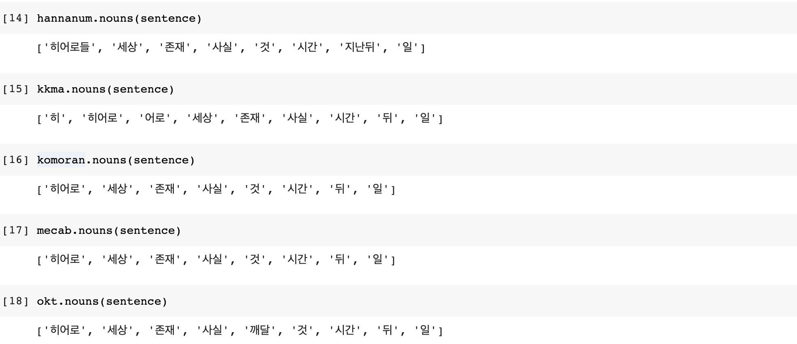

---

**2. 각 형태소 분석기의 morphs 메서드를 이용한 추출 결과**
1)Hannanum

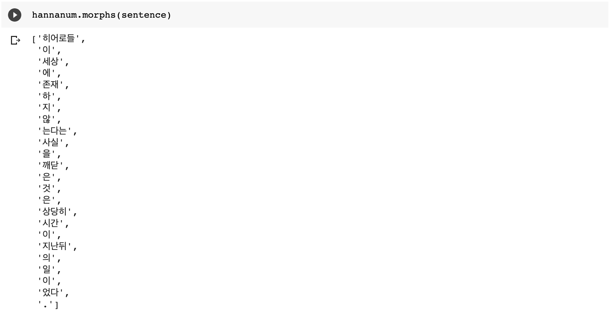

2)Kkma

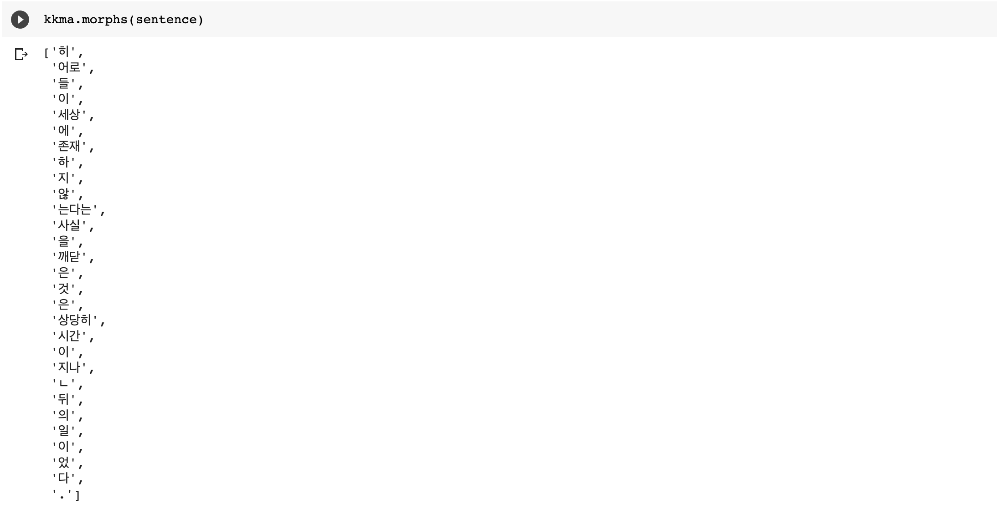

3)Komoran

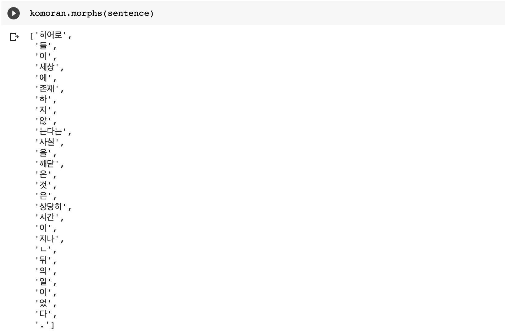

4)Mecab

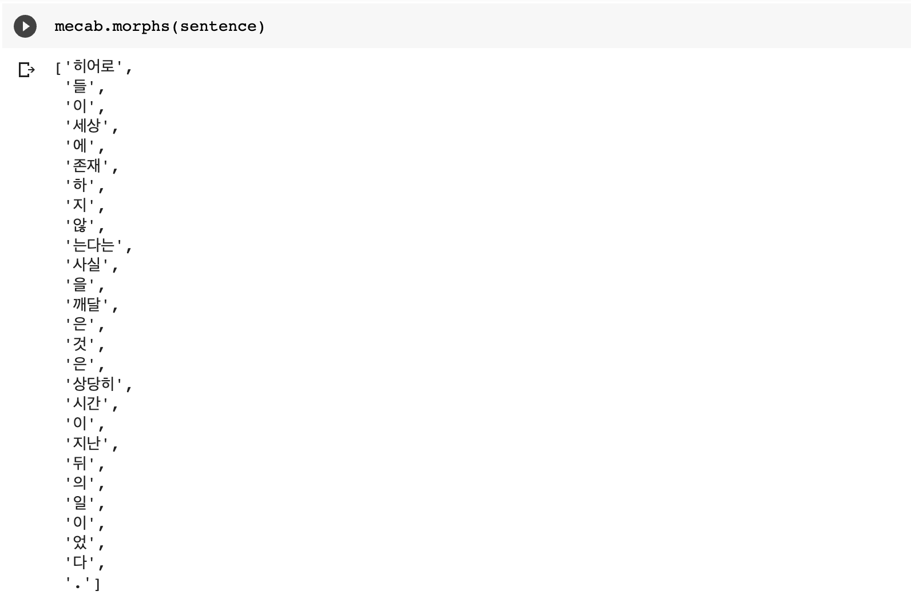

5)Okt

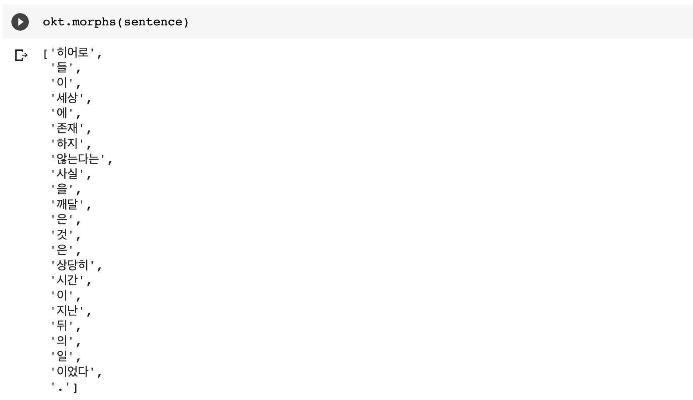

---

**3. 각 형태소 분석기의 pos 메서드를 이용한 추출 결과**
1)Hannanum

- Hannanum.pos(phrase,ntags = 9, flatten = False)


- Hannanum.pos(phrase,ntags = 9, flatten = True)

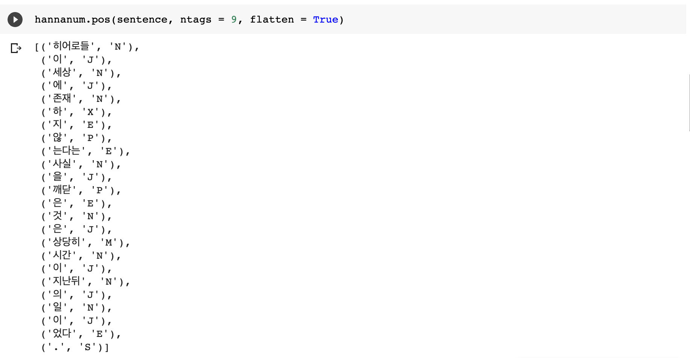

- Hannanum.pos(phrase, ntags = 22, flatten = False)


- Hannanum.pos(phrase, ntags = 22, flatten = True)


2)Kkma

- Kkma_pos(phrase, flatten = False)


- Kkma_pos(phrase, flatten = True)
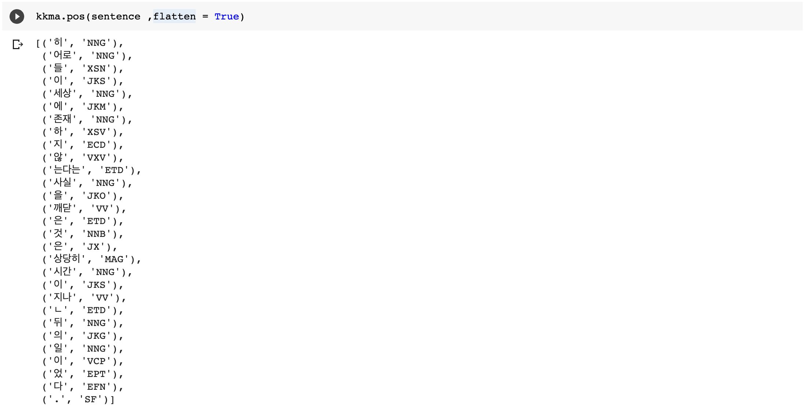

3)Komoran

- Komoran_pos(phrase, flatten = False)


- Komoran_pos(phrase, flatten = True)
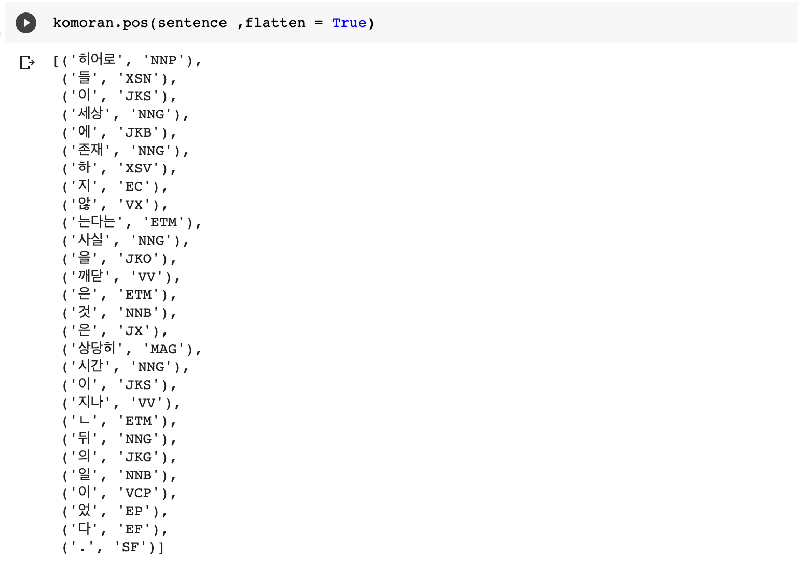

4)Mecab

- Mecab_pos(phrase, flatten = False)
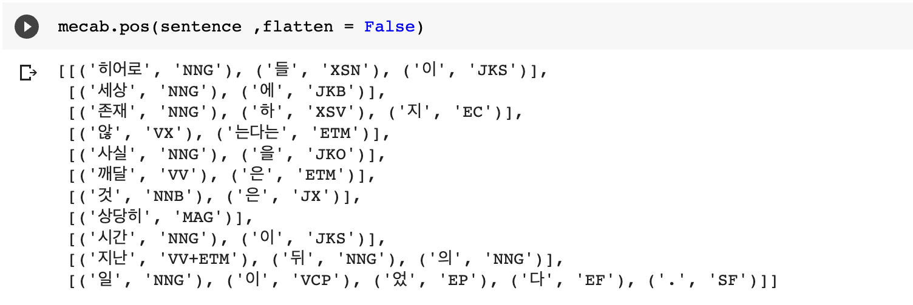

- Mecab_pos(phrase, flatten = True)
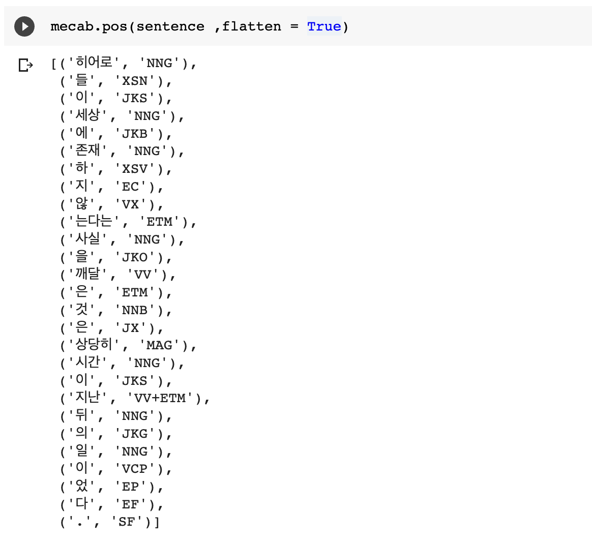

5)Okt

- Okt.pos(phrase, norm = False, stem = False)
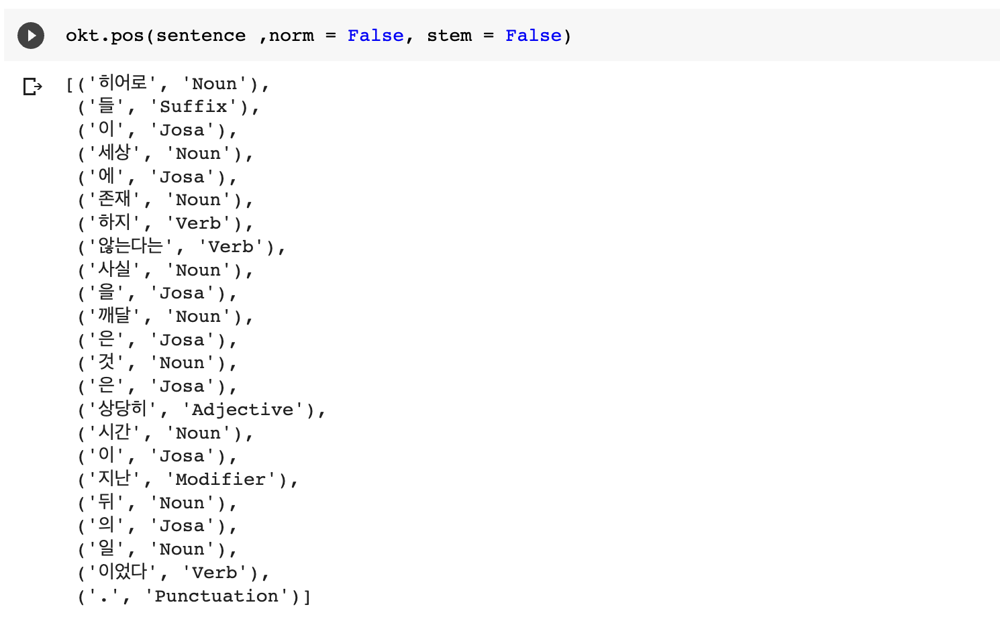

- Okt.pos(phrase, norm = True, stem = False)


- Okt.pos(phrase, norm = False, stem = True)
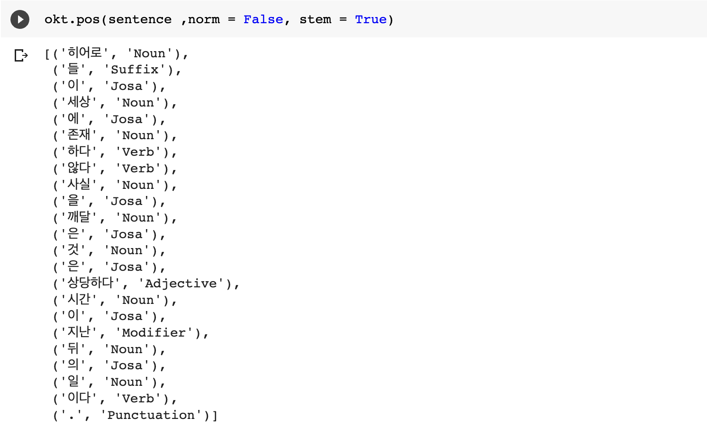

- Okt.pos(phrase, norm = True, stem = True)
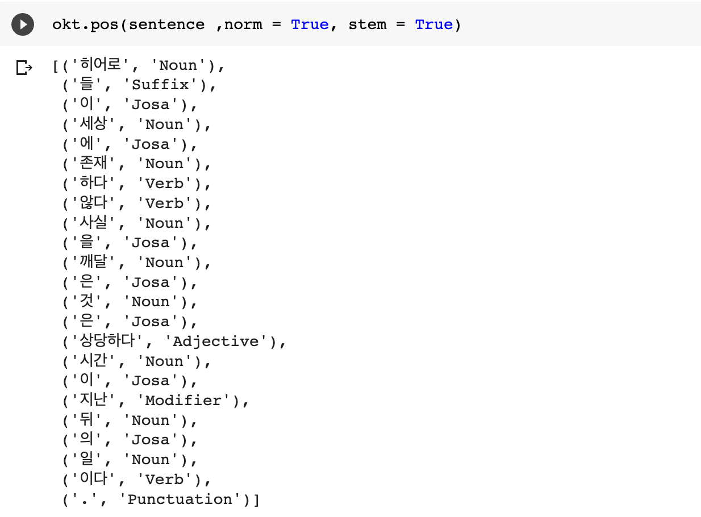

---

**4. 각 형태소 분석기의 독자적인 메서드를 이용한 추출 결과**
1)Hannanum.analyze(phrase)

실행 결과 형태학적으로 가능한 후보를 리턴하게 된다.

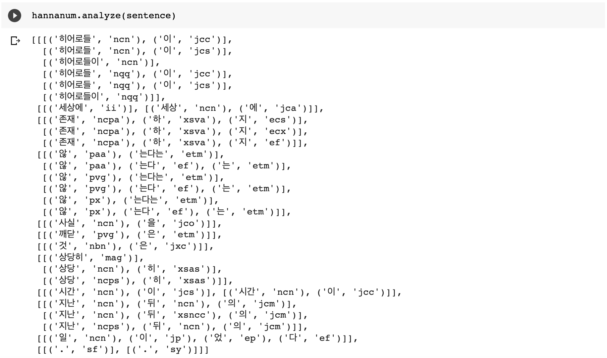

2)Kkma.sentences(phrase)

주어진 텍스트에서 문장을 감지하는 메서드로, 주어진 텍스트 안의 문장으로 구성된 리스트로 반환한다.


3)Okt.phrases(phrase)

입력한 텍스트의 구(phrase)를 추출한다.


### 마치며

아래의 그래프는 문자의 개수에 따른 각 형태소 분석기의 pos 메소드를 실행시간을 나타낸 것이다.

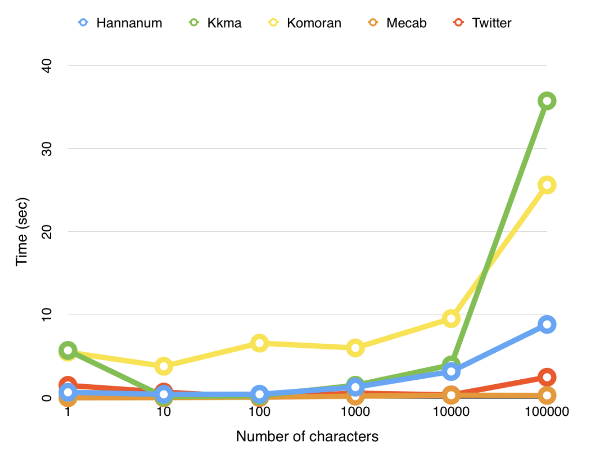

그래프만 놓고 봤을 땐 Mecab이 가장 빠르게 나온다.

하지만 형태소 분석기의 성능과 처리속도는 비례하지 않기 때문에 속도가 빠른 Mecab을 무조건적으로 선택하기 보다는 본인 상황에 맞는 형태소 분석기를 사용하는 것이 바람직할 것이다.
