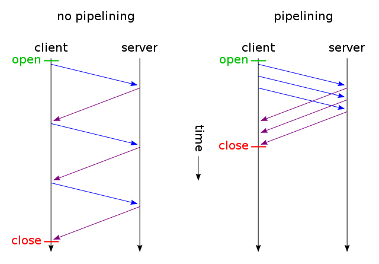
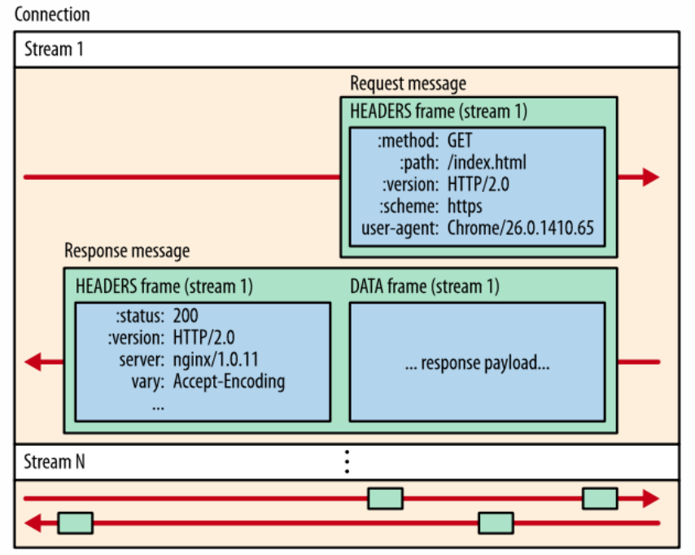
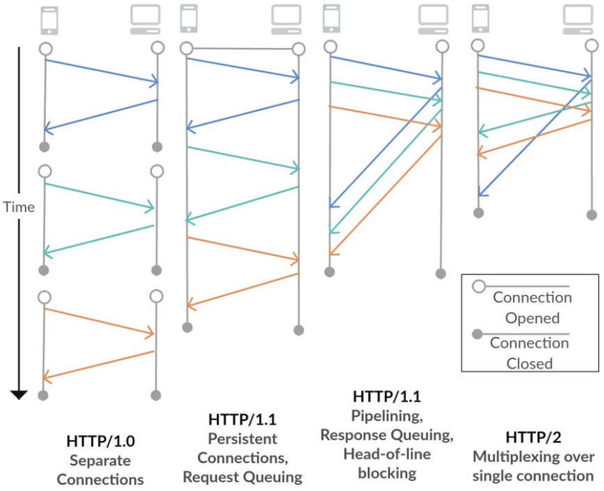
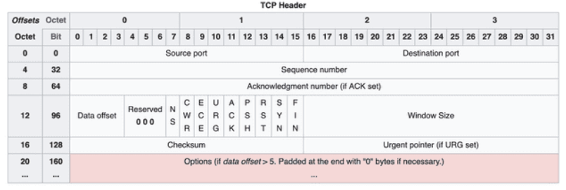
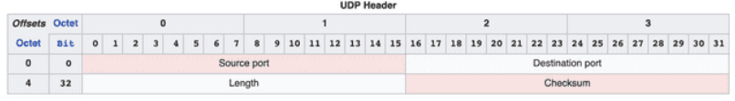

## INTRO

이번 포스팅에서는 HTTP 통신에 대한 전체적인 개요, 그리고 HTTP의 역사에 대해 알아보고자 합니다. HTTP에 대한 것들은 웹 개발 분야에 있어서는 필수적으로 알아야 하는 요소이고 HTTP가 어떻게 발전해 왔는지 알아보는 것도 의미가 있을 것 같아 이에 대해 소개하려 합니다. 어느 정도는 다들 알고 계실 것 같아서 교양 수업을 듣는 느낌으로 가볍게 읽어보시면 될 것 같네요ㅎㅎ

## HTTP의 개요

- **HTTP란?**

    HTTP (HyperText Transfer Protocol)는 HTML 문서와 같은 리소스들을 가져올 수 있도록 해주는 프로토콜입니다. 이는 웹에서 이루어지는 모든 데이터 교환의 기초이며, 클라이언트와 서버 간의 프로토콜이기도 합니다. 그리고 HTTP는 애플리케이션 레벨의 프로토콜로 TCP/IP 위에서 동작합니다.

  - **클라이언트와 서버의 소통**

    그렇다면 클라이언트와 서버는 HTTP을 이용해 어떤 과정으로 통신할까요? 클라이언트와 서버는 HTTP 메시지를 서로 보내어 통신하게 되는데, 클라이언트에서 서버에 보내는 메시지를 요청(requests), 반대로 서버에서 클라이언트에 보내는 메시지를 응답(responses)라고 합니다.

  1. 클라이언트는 서버에 요청을 보내고 응답을 기다린다.
  2. 서버는 받은 요청에 대한 결과를 만들어 응답한다.

  해당 순서로 클라이언트와 서버가 통신하게 되는 것이죠.

  - **HTTP의 특성**

    비연결성 (connectionless)

    이는 클라이언트와 서버가 한 번 연결을 맺은 후, 클라이언트 요청에 대해 서버가 응답을 마치면 맺었던 연결을 끊어 버리는 성질을 말합니다. 연결을 끊지 않을 채 계속 유지하게 되면 서버에 접속하는 클라이언트가 많아질수록 연결을 유지하는 서버의 자원이 계속해서 소모되기 때문입니다. 하지만 비연결성의 단점 또한 여럿 존재합니다. 대표적으로 웹이 진화하면서 각 웹 사이트에서 필요한 자원의 양이 많아지게 되어 웹 페이지를 다운로드받고 렌더링하기 위해 브라우저는 더 많은 동시성을 필요로 하게 되었습니다. 그때마다 TCP/IP를 위한 3 way Handshake시간이 추가된다는 것이었죠. 현재는 여러가지 방법으로 이 문제를 해결하고 있습니다. 이에 대한 부분은 아래 HTTP의 역사에 대해 이야기하며 소개하도록 하겠습니다.

    무상태 (stateless)

    비연결성의 특성 떄문에 서버는 클라이언트를 전혀 기억할 수 없는데 이러한 특성을 무상태라고 합니다. 연결을 요청한 클라이언트가 이전에 연결한 적이 있는 클라이언트인지, 새로운 클라이언트인지 식별할 수 없다는 것을 의미합니다.

## HTTP의 역사

- ### **HTTP 0.9**

    초기 HTTP에는 버전이 없었으나, 이후 버전들과 분리하기 위해 0.9라고 불리게 되었습니다. 사용할 수 있는 매서드는 GET이 유일했으며, 요청과 응답 과정 또한 매우 단순하였습니다. HTTP상태코드 또한 존재하지 않았기 때문에 문제가 생긴 경우 특정 HTML 파일을 오류에 대한 설명과 함께 보내는 방식으로 오류를 알렸습니다.

    요청은 한 줄이 다였으며,

    ```js
    GET/HelloWorld.html
    ```

    응답도 body가 전부인 매우 간단한 통신이었죠.

    ```js
    <HTML>
         Hello, my name is GDSC UOS.
    </HTML>
    ```

- ### **HTTP 1.0**

   1900년대가 되어 인터넷 시장이 급속히 커지기 시작되었고 HTML또한 발전하여 그에 따라 HTTP 프로토콜도 본격적으로 개선되기 시작했습니다. HTTP 1.0에서 새로 생긴 가장 큰 특징은 상태코드가 등장했다는 것입니다. 상태코드는 1xx ~ 5xx까지 제공되며 간략하게 설명하자면 다음과 같습니다.

  - 1xx (정보) : 요청을 받았으며 프로세스를 계속 진행합니다.
  - 2xx (성공) : 요청을 성공적으로 받았으며 인식했고 수용하였습니다.
  - 3xx (리다이렉션) : 요청 완료를 위해 추가 작업 조치가 필요합니다.
  - 4xx (클라이언트 오류) : 요청의 문법이 잘못되었거나 요청을 처리할 수 없습니다.
  - 5xx (서버 오류) : 서버가 명백히 유효한 요청에 대한 충족을 실패했습니다

- ### **HTTP 1.1 - 표준 프로토콜**

    HTTP 1.1은 HTTP 1.0이 출시된 지 몇 달 후 바로 출시되었으며 1.1에서 변화된 가장 큰 특징은 사용된 연결을 다시 열어 시간을 절약하게 된 것입니다. 위에서 언급했던 것처럼, 컨텐츠의 발달로 점점 보여줘야하는 컨텐츠의 양이 많아졌고 그에 따라 TCP연결에 부담이 생기기 시작했습니다. 그에 따라 TCP연결을 재사용해야 하는 필요성이 생겼고 HTTP 1.1에서는 **지속 연결(persistent connection)** 을 통해 하나의 TCP연결로 여러 개의 컨텐츠를 요청할 수 있게 되었습니다. 웹에서는 커넥션 재사용을 Keep-alive 또는 Conecction reuse라고 하며 1.0에서는 클라이언트가 Request Header에 Connection: keep-alive와 같은 값을 통해 연결을 유지했지만 1.1에서는 이 헤더가 없더라도 자동으로 TCP연결을 재사용 할 수 있게 되었습니다.

    또한, **파이라이닝**을 추가하여 하나의 연결에서 한 번에 순차적인 여러 요청을 연속적으로 하고 그 순서에 맞게 응답을 받는 순으로 서버가 응답하는 방식으로 바뀌었습니다. 이러한 방식을 통해 하나의 커넥션으로 다수의 요청과 응답을 처리할 수 있어 Network Latency를 줄일 수 있게 되었습니다.

    

    하지만 HTTP 1.1에도 한계점이 있었습니다. 예를 들어 HTML 리소스와 CSS 리소스의 순서로 서버에 요청을 보냈을 때, CSS 리소스가 먼저 처리되었더라도 HTML 리소스가 처리되지 않아 먼저 응답을 보낼 수 없는 현상이 발생하는 것이었습니다. 이를 **HOL(Head-of-Line) Block** 이라고 부르고 만약 첫 번째 요청이 오래 걸릴 경우 그 뒤의 모든 요청이 처리되었더라도 응답을 보낼 수 없는 비효율적인 상황이 발생하게 됩니다. 이러한 단점 때문에 파이프라이닝은 그 활용도가 제한적이었으며 대부분의 브라우저에서는 여러 개의 TCP연결을 만들어 병렬적으로 사용하는 **도메인 샤딩(Domain Sharding)**이라는 방식을 많이 사용하였습니다. 하지만 그 또한 여러가지 리소스를 많이 낭비하는 방식이었기에 이를 보완하고자 나온 것이 HTTP 2.0이었습니다.

- ### **HTTP 2.0**

    기존에 텍스트 기반으로 Header와 Data가 연결되고 있던 1.1 이하 버전과 다르게 2.0에서는 전송에 필요한 메시지들을 **Binary 단위**로 구성하며 필요 정보를 더 작은 프레임으로 쪼개서 관리합니다.

  - Frame : HTTP 2.0에서 통신의 최소 단위
  - Message : HTTP 1.1과 똑같은 요청 또는 응답의 최소 단위로써, 다수의 프레임으로 이루어져 있음
  - Stream : 클라이언트와 서버가 맺은 연결을 통해 양방향으로 주고받는 하나 또는 여러 개의 메시지들

    다시 말해, 여러 개의 프레임이 하나의 메시지를 이루고, 여러 메시지들이 모여 하나의 스트림을 만드는 것입니다.

    

    또한 1.1의 파이프라인과 도메인 샤딩에서 발생한 HOL 문제를 해결하였습니다. 2.0에서는 한 커넥션으로 동시에 여러 개의 메시지를 주고 받을 수 있으며, 응답은 순서에 상관없이 바이너리 프레임의 스트림 전송으로 처리하는 **멀티플렉싱 (MultiFlexing)** 방식을 사용하였습니다.

    

    이 방법은 요청 또는 응답은 출발 순서에 상관없이 뒤섞여서 도착하게 되고, 도착한 곳(클라이언트 또는 서버)에서 해당 프레임을 재조립하는 방식으로 이를 통해 특정 응답의 지연 문제를 해결할 수 있었습니다.

- ### **HTTP 3.0**

    HTTP 3.0에서 가장 큰 변화는 2.0 이하의 버전에서는 TCP기반의 통신을 사용했지만 3.0에서는 **UDP기반의 QUIC(Quick UDP Internet Connection) 프로토콜을 이용해 통신**한다는 것입니다.

    먼저 지금까지는 TCP기반의 통신을 하였는데 왜 3.0에서는 UDP를 선택했는지 알아보기 위해 TCP와 UDP의 가장 큰 차이를 간략하게 알아보면 TCP는 신뢰성이 높은 대신 전송 속도가 느린 특징이 있고, 이와 반대로 UDP는 신뢰성이 낮은 대신 전송 속도가 빠르다는 장점이 있습니다. 지금까지 HTTP가 발전하며 TCP 통신에서 발생하는 3 way handshake, HOL Blocking등의 Latency를 줄이기 위해 많은 변화들이 있어왔지만 점차 기술이 발전함에 따라 전송해야하는 데이터의 크기가 커지고 결국에는 또 느려지는 문제가 반복되었던 것이었습니다. 이런 제약을 뛰어넘기 위해 3.0에서는 속도가 빠른 UDP를 선택하고 TCP와는 다른 방식으로 신뢰성을 확보할 수 있도록 하였습니다.

    사실 TCP와 UDP의 특징을 더 뜯어서 보면 **TCP는 ‘신뢰성을 보장하기 위해 이미 많은 기능들이 포함되어 있는 것’**, **UDP는 ‘데이터 전송 기능을 제외하면 아무 것도 정의되지 않은 것’**이라고 생각하면 될 것 같습니다. 이는 TCP와 UDP의 헤더를 비교해보면 한 눈에 볼 수 있습니다.

    

    

    즉, UDP를 사용하면 신뢰성 보장을 위해 ‘필요한 것들만’ 추가하여 충분히 TCP와 비슷한 수준의 기능을 가질 수도 있는 것이었습니다.

    다시 말해, HTTP 3.0에서는 UDP기반의 QUIC 프로토콜을 이용해 통신함으로써 이전보다 더 빠른 속도를 구현하면서도 충분히 신뢰성을 보장할 수 있도록 발전하였습니다.

## 마무리

이번 포스팅을 통해 HTTP에 대한 개요와 그 역사를 알아보았습니다. 포스팅에서 소개된 내용은 정말 간단한 소개라고 할 수 있으니 이번 포스팅을 통해 이 주제에 대해 관심이 생기신 분들은 더 자세히 공부해보셔도 좋을 것 같아요! 감사합니다 :)

## 참고

[HTTP의 진화](https://developer.mozilla.org/ko/docs/Web/HTTP/Basics_of_HTTP/Evolution_of_HTTP)

[HTTP통신 & 통신 프로토콜](https://velog.io/@fnrkp089/HTTP통신-통신-프로토콜)

[HTTP 0.9에서 3.0까지](https://velog.io/@seeker1207/HTTP-0.9에서-HTTP-3.0까지)

[HTTP/3는 왜 UDP를 선택한 것일까?](https://evan-moon.github.io/2019/10/08/what-is-http3/)
