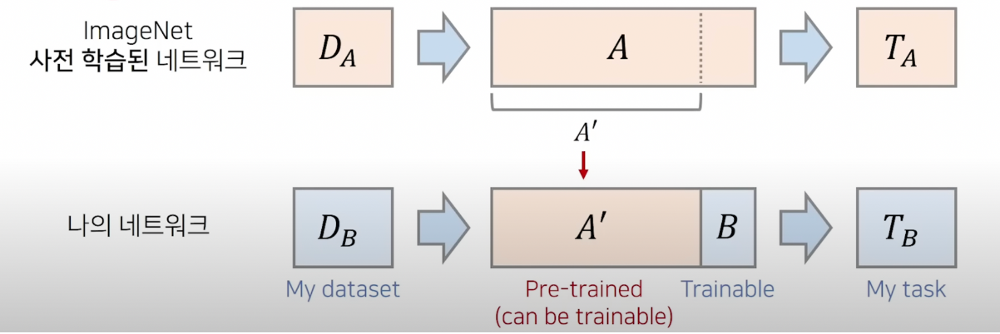
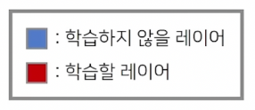
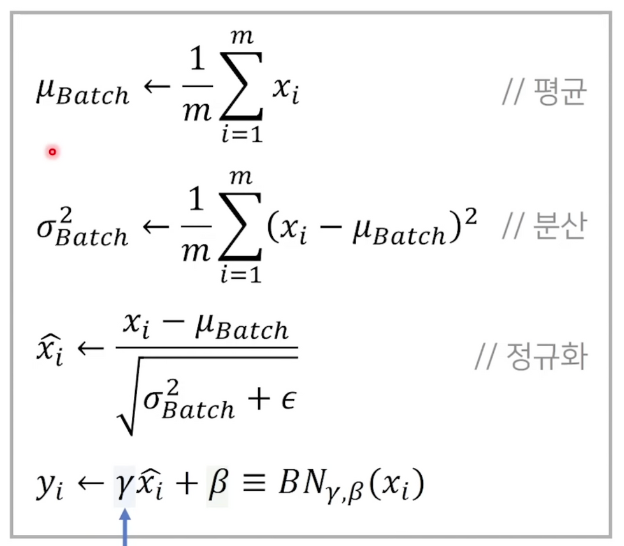
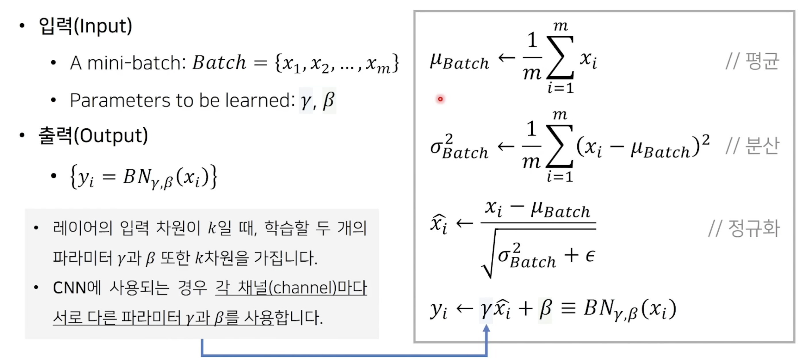
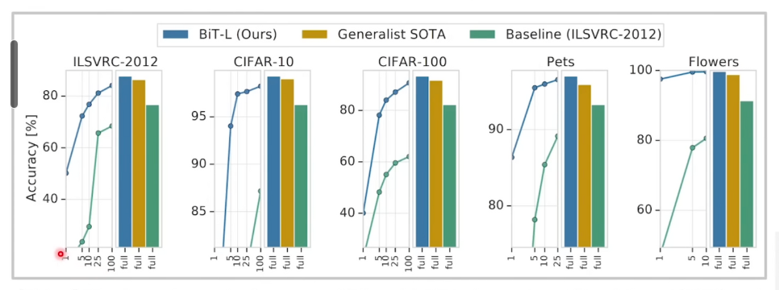
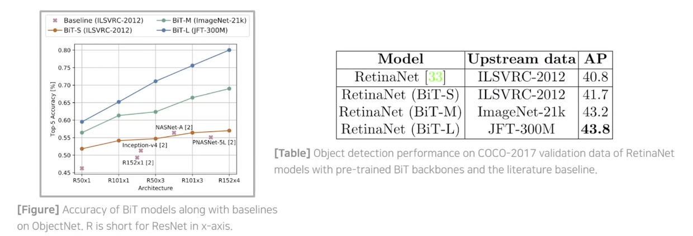
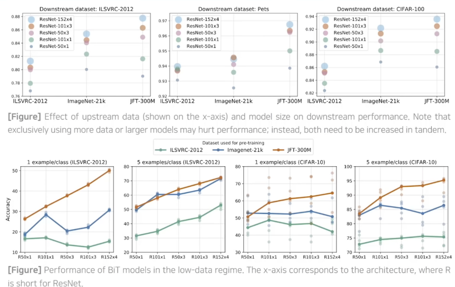
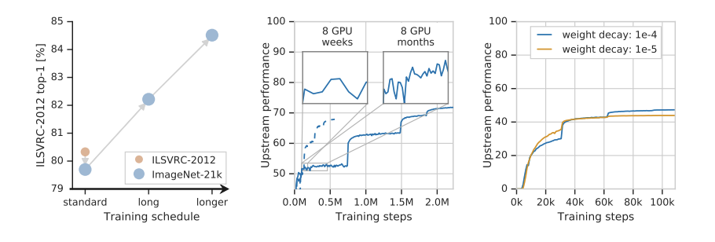
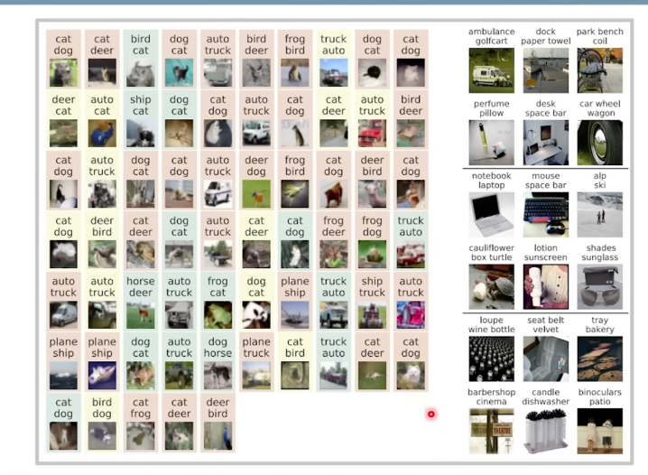

# BiT

 안녕하세요. 제가 이번 블로그 게시물에서 소개할 논문은 ECCV 2020에 발표된 Big Transfer(BiT)모델 입니다.

구체적으로 본 논문에서는 전이 학습(transfer learning)에 효과적으로 사용할 수 있는 대규모 모델을 제안하며 
&nbsp; 이를 통해 적은 양의 데이터 및 컴퓨팅 자원으로 높은 정확도를 이끌어내 효율성을 추구하였다고 볼 수 있습니다.  
  

## 목차
[1.Representation Learning 소개](#representation-learning)

[2.전이 학습의 개요](#전이-학습(transfer-learning)의-개요)

[3.[배경지식] 전이 학습 구현 방식](#[배경지식]-전이-학습-구현-방식)

[4.[배경지식]  배치 정규화](#[배경지식]-배치-정규화)

[5.Upstream ](#upstream-사전에-좋은-특징-추출기를-만들기-위해-사용)

[6.Downstream ](#downstream-fine-tuning)

[7.Fine-tuning 비교 ](#fine-tuning-비교)

[8.SSL(준지도학습)과 비교](#준지도학습-이란)

### Representation Learning

→ <b>Representatioin Learning</b> 이란  feature == semantic feature == representation 를 학습하는 것입니다.

- 본 논문의 메서드는 이전까지 SOTA이상의 높은 정확도를 보입니다.

 
- 본 논문의 메서드는 데이터 세트의 크기가 작을 때에도 매우 높은 정확도를 보입니다.
    - 클래스당 10개의 이미지가 있는 ILSVRC-2012 데이터 세트는 76.8%의 정확도
    - 클래스당 10개의 이미지가 있는 CIFAR-10 데이터 세트는 97.0%의 정확도를 보였습니다.
 

## 전이 학습(Transfer Learning)의 개요

- $T_{A}$ = task A
- $D_A$ = data A

 
<b>학습속도 개선</b>

- 보통 CIFAR-10의 경우 epoch 100~200 이 baseline(기본)인데 5~10번 정도로 해도 충분합니다.
- $D_A$로 사전 학습된 모델을 불러와 feature extractor의 가중치를 초기 가중치로 불러옵니다.
이후 나의 네트워크 끝 부분에 예를 들어 예측 클래스가 4개라면 출력이 4개인 FC Layer(=B)를 붙여 
학습시키면 됩니다.
- $T_{A}$ , $T_{B}$ 가 동일하지 않아도 $D_A$ $D_B$ 가 유사한 특징을 가지면 학습속도 개선 및 정확도 향상이 가능합니다.
- $D_B$가 매우 작은 크기 일때에도 높은 정확도를 보입니다.
 

## [배경지식] 전이 학습 구현 방식

### 1. Freezing 방식

- Conv base는 일부분 or 전부 고정하고 나머지 Conv base 층이나 Classifier층만 새롭게 학습하는 
방법입니다.
- Over-fitting에 더 강인합니다.

### 2. Fine-tuning

- 사전 학습 모델의 구조만 사용하면서, 자신의 데이터셋에 맞게 모델을 전부 새롭게 학습시키는 방법입니다.
- 앞 부분까지 다시 다 학습시킵니다.
- 더 좋은 정확도를 얻기 좋습니다.

## [배경지식]  배치 정규화

- 배치 정규화란 Hidden Layer의 Input도 정규화를 하자는 것입니다.
- 감마 , 베타는 학습이 가능합니다.
- 장점으로는
    - 학습 속도를 빠르게 할 수 있습니다.
    - 가중치 초기화에 대한 민감도를 감소시킵니다.
    - 모델의 일반화 효과가 있습니다.

- mini-batch size란 한번에 학습을 위해 들어가는 이미지의 개수입니다.
- x:  hidden layer에 들어가는 feature , 
m = hidden layer에 들어가는 feature의 개수입니다.
- 각 채널(차원)마다 $\gamma$ , $\beta$ 가 다르게 적용됩니다.
- 감마 : 스케일
베타 : 데이터 상하좌우 이동 (translate)

## Upstream 사전에 좋은 특징 추출기를 만들기 위해 사용

### 1. 규모

- BiT-S : 약 130만개 이미지를 포함한 ILSVRC-2012 데이터 세트
- BiT-M : 약 1400만개 이미지를 포함한 ImageNet-21k 데이터 세트
- BiT-L :  약 3억개의 이미지를 포함한 JFT-300M 데이터 세트
- Bit-S : small 인 이유 = 100만개 정도의 이미지로는 충분히 분류하기에 부족하다고 생각해서
- Bit-L : Large = 사람이 평생 접근하기도 어려운 많은 양

- ResNet에 기반한 네트워크 아키텍처를 활용합니다.
    - ResNet-152x4는 152개의 레이어를 사용하여 너비가 4배 증가된 Wide ResNet입니다.
    - ResNet-50x1 부터 ResNet-152x4까지 다양한 크기의 아키텍처를 사용하여 실험을 진행합니다.

**큰 크기의 데이터 세트로 단 한번의 pre-training만 수행하면 됩니다.**

**이후에 downstream tasks로의 fine-tuning은 상대적으로 낮은 비용이 요구됩니다.**

 

### 2. 정규화 기법

- 본 논문에서는 BN을 사용하지 않습니다.
    - BN 사용 시 모델이 크고, 이미지의 해상도가 높아서
    장치(gpu device)당 작은 배치를 사용해야 합니다.
    - 이때, 정확도가 하락하거나 장치간 동기화 비용이 증가하는 문제가 발생합니다.
- Batch Norm
    - Batch만큼 모아서 채널별로 수행합니다.
- LayerNorm
    - 채널과 모듈(H,W)를 한데 모아서 수행합니다.
    - 각각의 이미지 마다 수행합니다.
- Instance Norm
    - 이미지마다 얻은 하나의 feature map으로 학습합니다.
- Group Norm
    - 채널에서 원하는 몇개만 묶어서 Norm을 진행합니다.
    - LayerNorm + Instance Norm

- 본 논문에서는 Group Normalization과 Weight Standardization을 함께 사용하여 
배치 크기에 영향을 받지 않도록 합니다.

N: 배치 축 

C: 채널 크기 

H: 높이 

W: 너비

## Downstream Fine-Tuning

### BiT-HyperRule :  Hyperparameter 조정 방법

- BiT에서는 사전 학습(pre-training)과 fine-tuning 과정에서 차이점이 존재합니다.

1. Weight-Decay (정규화)
    
    가중치에 대해 제약조건을 걸어놓습니다.
    
    L2 norm을 많이 사용합니다.
    
2. MixUp 2개의 데이터씩 pair로 묶어 2개의 정보를 묶어 사용합니다. (데이터 증진 기법) 

- Fine-tuning을 할때는 기본적인 데이터 전처리 방법을 사용합니다.
    1. 사각형으로 image를 resize
    2. 작은 사각형으로 Crop Out 하기
    3. 랜덤하게 좌우로 이미지를 반전시킴 

## Fine-tuning 비교

### Upstream fine-tuning

- ResNet-152x4 아키텍처를 사용하고, BN 대신에 GN과 WS로 대체합니다.
- SGD momentum 0.9 , 초기 learning rate = 0.03을 사용합니다.
- 전처리 : 1.Image Cropping 2. Random Horizontal mirroring 3. 224x224 image resize
- Global Batch Size = 4096
TPUv3-512 : 512개의 chip / 칩당 8개의 이미지가 들어갑니다.

### Downstream fine-tuning

- SGD momentum 0.9 , 초기 learning rate = 0.003을 사용합니다.
pre-training시 정해진 가중치가 바뀔 수 있어 낮은 learning rate를 사용합니다.
- small task : 500 step만 (500번의 batch만 학습) (epoch아님)

TPUv3-512 : 512개의 chip / 칩당 8개의 이미지가 들어갑니다. 

- 두 과정 모두에서 Learning rate decay를 사용합니다. 
(학습할수록 learning rate가 줄어드는 방식)

### 분석 결과 비교

- Generalist : 일반적으로 모든 downstream에 적용될 수 있는 모델 
본 논문과의 비교 대상입니다.
- Specialist : 해당 task만을 위한 pre-trained representation을 이용합니다.
    - 예를 들면 각각 ILSVRC-2012(imagenet)에 맞게 pre-trained시킵니다.
    

- pre-trained ResNet-50 모델
    - 일반적으로 pytorch 나 tensorflow로 불러오는 모델
- X축: fine-tuning시 사용되는 input의 클래스당 이미지 수
- 클래스당 이미지의 개수가 1개나 10개 정도로 매우 적은 정도임에도 
매우 높은 정확도를 얻을 수 있습니다.

### 데이터 세트의 크기

데이터세트의 크기와 아키텍처의 크기가 커질 수록 성능이 좋아지는 것을 확인할 수 있습니다. 

### 준지도학습 이란

- 데이터 중 일부만 레이블 정보가 있고 없는 것은 
feature를 사용하는 방식입니다.
- Decision boundary를 만드는 것이 목표입니다.

### 준지도 학습과 비교(Few-Shot Learning)

- SSL(semi supervised learning)과의 비교  ⇒ 당시 가장 최신 모델인 ReMixMatch와 비교하였습니다.
- CIFAR-10 (5만개의 이미지)
    - SSL : 클래스당 25개는 labeled , 나머지(5만- 250개)는 unlabeled 데이터 사용하였습니다.
    - BiT : OOD(분포에서 벗어남) labeled data 로 pretrained 
    클래스당 25개 unlabeled 사용하였습니다.
    - 정확도, 비용 측면에서 BiT가 매우 좋습니다.
    하지만 사용 데이터가 달라 직접적인 비교는 어렵습니다.
    

    

### 다양한 Task에 대해 실험

1. ObjectNet 세트에서도 높은 정확도를 보입니다.
2. RetinaNet의 인코더 부분을 Bit-S/M/L로 바꾸었을 때 높아진 정확도를 보입니다. 

### 데이터 아키텍처 크기와 데이터 크기의 관계

오히려 아키텍처 크기가 작으면 데이터 크기를 키웠을 때 정확도가 떨어지는 상황이 생기는 것을 확인 가능합니다.

### 큰 데이터 세트로 학습할 때 고려사항

- 큰 데이터 세트로 학습할 때에는 충분히 많은 학습 시간으로 진행해야 합니다.
- 충분히 기다려서 완전히 수렴할때마다 learning rate decay를 수행해야 
성능이 좋아집니다.

### 정규화 기법

- batch norm 사용시 
큰 모델을 사용하여 chip당 배치 크기가 작고 따라서 정확도 하락, 지연이 발생합니다.
- GN+WS 사용시 batchsize에 구애받지 않아서 
batchsize를 충분히 키워 병렬적으로 학습을 시켜 속도를 높일 수 있습니다.

### BiT의 예측 실수 사례 분석(사람이 직접)

- 왼쪽
    - 초록 노랑 : 오히려 BiT가 내린 결정이 타당하다.
    - 빨강 : BiT가 틀렸다고 판단된다.
- 오른쪽
    - Top (위에서 6개) : 모델의 예측이 레이블보다 정확한 경우 (ImageNet클래스의 개수가 1000개다보니 발생함)
    - Middle (가운데 6개) : Top-5 예측은 맞은 경우
    - Bottom (아래 6개) :  Top-10 예측이 모두 틀렸으나 레이블이 애매함

### 참고

&nbsp;
https://www.youtube.com/watch?v=P5qemCucZ14 를 참고하였습니다.

